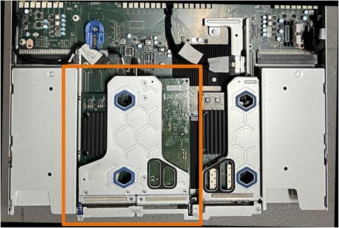

// Replace CMOS battery in SGF6112, SG110, SG1100
// Intro and before you begin, and after you finish are in referencing topic

.About this task
To prevent service interruptions, confirm that all other Storage Nodes are connected to the grid before starting the CMOS battery replacement or replace the battery during a scheduled maintenance window when periods of service disruption are normally expected. See the information about https://review.docs.netapp.com/us-en/storagegrid-118_main/monitor/monitoring-system-health.html#monitor-node-connection-states[monitoring node connection states^].

IMPORTANT: If you have ever used an ILM rule that creates only one copy of an object, you must replace the battery during a scheduled maintenance window. Otherwise, you might temporarily lose access to those objects during this procedure. See information about https://review.docs.netapp.com/us-en/storagegrid-118_main/ilm/why-you-should-not-use-single-copy-replication.html[why you should not use single-copy replication^].

.Steps

. Wrap the strap end of the ESD wristband around your wrist, and secure the clip end to a metal ground to prevent static discharge.
. Locate the two-slot riser assembly at the rear of the appliance.
+

//The three NICs in the appliance are in two riser assemblies in the positions in the chassis shown in the photograph (Rear of appliance with top cover removed shown): 
+

. Grasp the riser assembly through the blue-marked holes and carefully lift it upwards. Move the riser assembly toward the front of the chassis as you lift it to allow the external connectors in its installed NICs to clear the chassis.
. Place the riser on a flat anti-static surface with the metal frame side down.
. Locate the CMOS battery on the system board in the position beneath the removed riser assembly. 
+
image::../media/SGF6112-cmos-position.png[CMOS battery location]

. Use your finger or a plastic pry tool to press the retaining clip (highlighted) away from the battery to spring it from the socket. 
+
image::../media/SGF6112-battery-cmos.png[CMOS battery clip]

. Remove the battery and dispose of it properly. 

== Reinstall the CMOS battery
Install the replacement CMOS battery into the socket on the system board.

.Before you begin

* You have the correct replacement CMOS battery (CR2032).
* You have removed the failed CMOS battery.

.Steps

. Wrap the strap end of the ESD wristband around your wrist, and secure the clip end to a metal ground to prevent static discharge.
. Remove the CMOS battery from its packaging.
. Press the replacement battery into the empty socket on the system board with the positive (+) side up until the battery snaps in place.

. Locate the alignment hole on the two-slot riser assembly (circled) that aligns with the guide pin on the system board to ensure correct riser assembly positioning.
+
image::../media/sgf6112_two-slot-riser_alignment_hole.png[Alignment hole on large riser assembly]
+
. Locate the guide pin on the system board 
+
image::../media/sgf6112_two-slot-riser_guide-pin.png[Guide pin on system board for two-slot riser assembly]

. Position the riser assembly in the chassis, making sure that it aligns with the connector on the system board and guide pin. 

. Carefully press the two-slot riser assembly in place along its center line, next to the blue-marked holes, until it is fully seated.

. If you have no other maintenance procedures to perform in the appliance, reinstall the appliance cover, return the appliance to the rack, attach cables, and apply power.

. If the appliance where you replaced the appliance used a key management server (KMS) to encrypt data, additional configuration might be required before the node can join the grid. If the node does not automatically join the grid, make sure that these configuration settings have transferred to the new appliance and manually configure any settings that don't have the expected configuration:
** link:../installconfig/accessing-storagegrid-appliance-installer.html[Configure StorageGRID connections]
** https://review.docs.netapp.com/us-en/storagegrid-118_main/admin/kms-overview-of-kms-and-appliance-configuration.html#set-up-the-appliance[Configure node encryption for the appliance^]

. Log in to the appliance:
  .. Enter the following command: `ssh admin@_grid_node_IP_`
  .. Enter the password listed in the `Passwords.txt` file.
  .. Enter the following command to switch to root: `su -`
  .. Enter the password listed in the `Passwords.txt` file.
. Restore BMC network connectivity for the appliance. There are two options: 
* Use static IP, netmask, and gateway 
* Use DHCP to obtain an IP, netmask, and gateway

.. To restore the BMC configuration to use a static IP, netmask, and gateway, enter the following commands:
+
`*run-host-command ipmitool lan set 1 ipaddr _Appliance_IP_*`
+
`*run-host-command ipmitool lan set 1 netmask _Netmask_IP_*`
+
`*run-host-command ipmitool lan set 1 defgw ipaddr _Default_gateway_*`

.. To restore the BMC configuration to use DHCP to obtain an IP, netmask, and gateway, enter the following command: 
+
`*run-host-command ipmitool lan set 1 ipsrc dhcp*`

. After restoring BMC network connectivity, connect to the BMC interface to audit and restore any additional custom BMC configuration you might have applied. For example, you should confirm the settings for SNMP trap destinations and email notifications. See link:../installconfig/configuring-bmc-interface.html[Configure BMC interface].
. Confirm that the appliance node appears in the Grid Manager and that no alerts appear. 