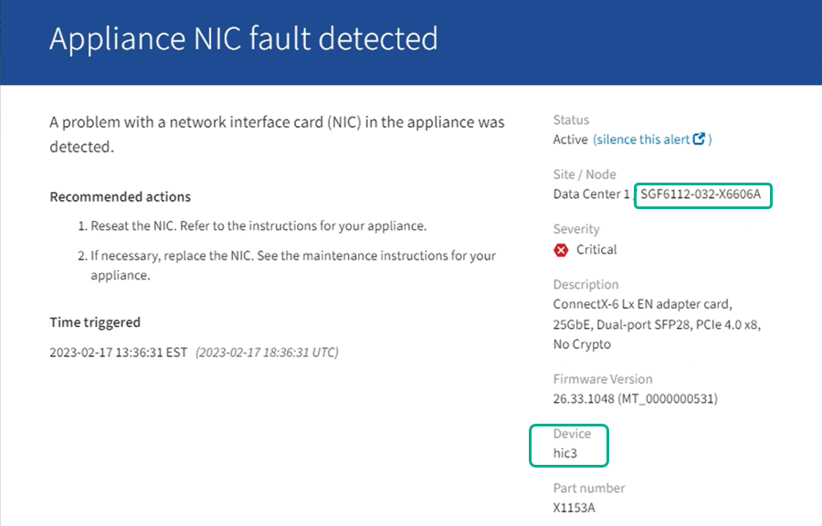

// Verify component to replace for SGF6112, SG110, SG1100
// Intro and related info are in referencing topic

.Before you begin

* You have the serial number of the storage appliance where the component needs to be replaced.

* You are signed in to the Grid Manager using a https://docs.netapp.com/us-en/storagegrid-118/admin/web-browser-requirements.html[supported web browser^].

.About this task

Use this procedure to identify the appliance with failed hardware and which of the replaceable hardware components is not operating properly. Components that might be identified for replacement can include: 

* Power supplies
* Fans
* Solid state drives (SSDs)
* Network Interface Cards (NICs)
* CMOS battery

.Steps

. Identify the failed component and the name of the appliance that it is installed in. 
.. In Grid Manager, Select *ALERTS* > *Current*.
+
The Alerts page appears.

.. Select the alert to see the alert details.
+
NOTE: Select the alert, not the heading for a group of alerts.

.. Record the node name and unique identifying label of the component that has failed.
+

. Identify the chassis with the component that needs to be replaced.
.. From the Grid Manager, select *NODES*.
.. From the table on the Nodes page, select the appliance Storage Node name with the failed component.
.. Select the *Hardware* tab.
+
Check the *Compute controller serial number* in the StorageGRID Appliance section. Check if the serial number matches the serial number of the storage appliance where you are replacing the component. If the serial number matches, you have found the correct appliance.

 ** If the StorageGRID Appliance section in Grid Manager does not display, the node selected is not a StorageGRID appliance. Select a different node from the tree view.
 ** If the serial numbers don't match, select a different node from the tree view.

. After you locate the node where the component needs to be replaced, write down the appliance BMC IP address listed the StorageGRID Appliance section.
+
To help you locate the appliance in the data center, you can use the BMC IP address to turn on the appliance identify LED.
