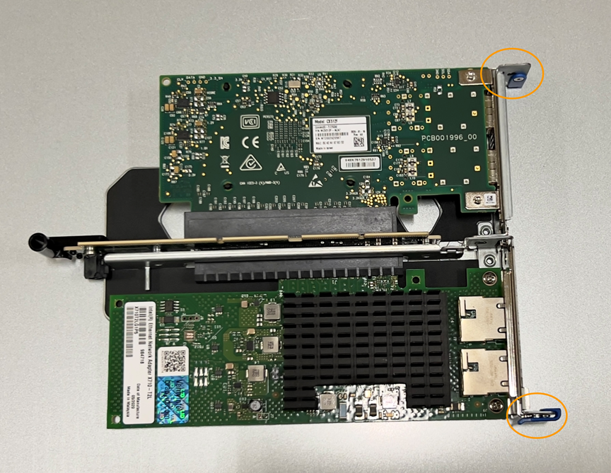
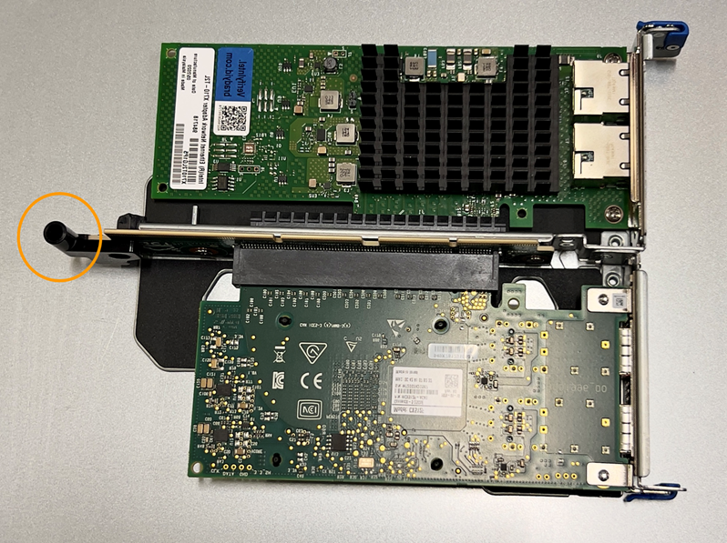
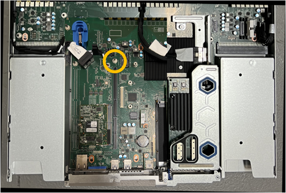
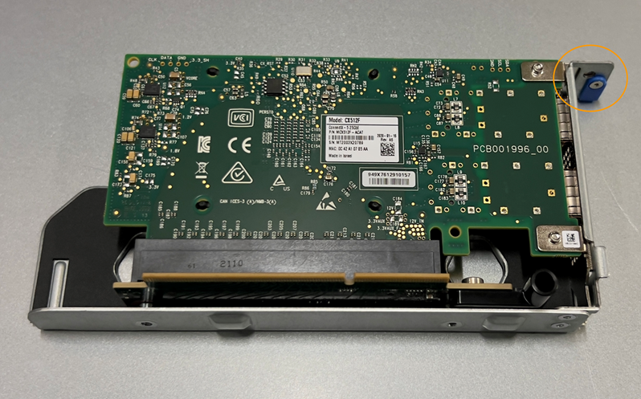
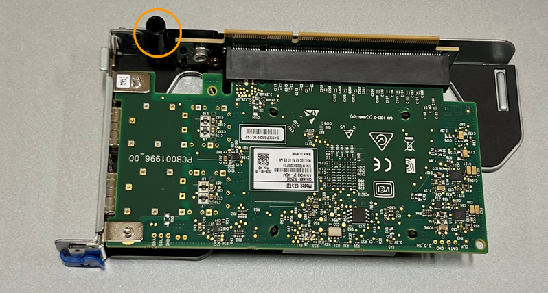
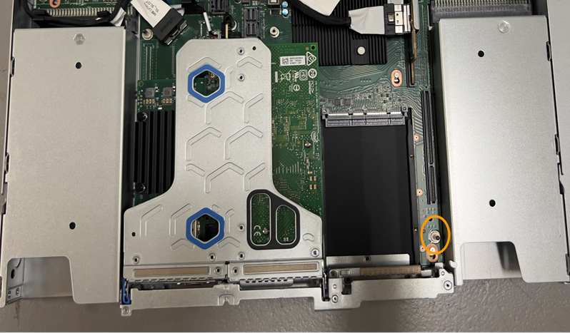

// Replace NIC SGF6112, SG110, SG1100
// Intro, before you begin, and about this task are in referencing topic

== Step 1: Remove the NIC

.Steps

. Wrap the strap end of the ESD wristband around your wrist, and secure the clip end to a metal ground to prevent static discharge.
. Locate the riser assembly that contains the NIC at the rear of the appliance.
+
The three NICs in the appliance are in three riser assemblies in the positions in the chassis shown in the following illustration (Rear of appliance with top cover removed shown): 
+
*Image will be included*

. Grasp the riser assembly with the failed NIC through the blue-marked holes and carefully lift it upwards. Move the riser assembly toward the front of the chassis as you lift it to allow the external connectors in its installed NICs to clear the chassis.
. Place the riser on a flat anti-static surface with the metal frame side down to access the NICs.
. Open the blue latch on the NIC to be replaced and carefully remove the NIC from the riser assembly. Rock the NIC slightly to help remove the NIC from its connector. Don't use excessive force.
. Place the NIC on a flat anti-static surface.

== Step 2: Reinstall the internal NIC
Install the replacement NIC into the same location as the one that was removed.

.Steps

. Wrap the strap end of the ESD wristband around your wrist, and secure the clip end to a metal ground to prevent static discharge.
. Remove the replacement NIC from its packaging.

. If you are replacing one of the NICs in the two-slot riser assembly, do the following:
.. Ensure the blue latch is in the open position.
.. Align the NIC with its connector on the riser assembly. Carefully press the NIC into the connector until it is fully seated, as shown in the photograph, and then close the blue latch.
+
 

.. Locate the alignment hole on the two-slot riser assembly (circled) that aligns with a guide pin on the system board to ensure correct riser assembly positioning.
+
 
+
.. Locate the guide pin on the system board 
+
 

.. Position the riser assembly in the chassis, making sure that it aligns with the connector on the system board and guide pin. 

.. Carefully press the two-slot riser assembly in place along its center line, next to the blue-marked holes, until it is fully seated.

. If you are replacing the NIC in the one-slot riser assembly, do the following: 
.. Ensure the blue latch is in the open position.
.. Align the NIC with its connector on the riser assembly. Carefully press the NIC into the connector until it is fully seated as shown in the photograph and close the blue latch.
+
 

.. Locate the alignment hole on the one-slot riser assembly (circled) that aligns with a guide pin on the system board to ensure correct riser assembly positioning.
+
 
+
.. Locate the guide pin on the system board 
+
 

.. Position the one-slot riser assembly in the chassis, making sure that it aligns with the connector on the system board and guide pin. 

.. Carefully press the one-slot riser assembly in place along its center line, next to the blue-marked holes, until it is fully seated.

. Remove the protective caps from the NIC ports where you will be reinstalling cables.

.After you finish

If you have no other maintenance procedures to perform in the appliance, reinstall the appliance cover, return the appliance to the rack, attach cables, and apply power.

include::../_include/fru-statement.adoc[] 
