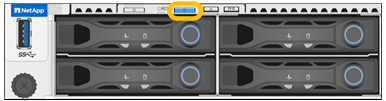

// Turn on identify LED for SG6200-CN, SGF6212, SG120, SG1200
// Intro and related info are in referencing topic

.Before you begin

You have the BMC IP address of the appliance you want to identify.

.Steps

. link:../installconfig/accessing-bmc-interface.html[Access the appliance BMC interface].
. Select *Server Identify*.
+
The current status of the identify LED is selected.
. Select *ON* or *OFF*, and then select *Perform Action*.
+
When you select *ON*, the blue identify LEDs light on the front and rear of the appliance.
+
 
+
NOTE: If a bezel is installed on the controller, it might be difficult to see the front identify LED.
+
The rear identify LED is at the center of the appliance next to the Micro-SD slot.
+
.  Turn the identify LEDs on and off as needed.

