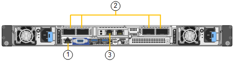
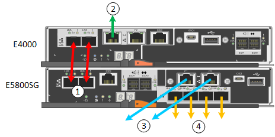
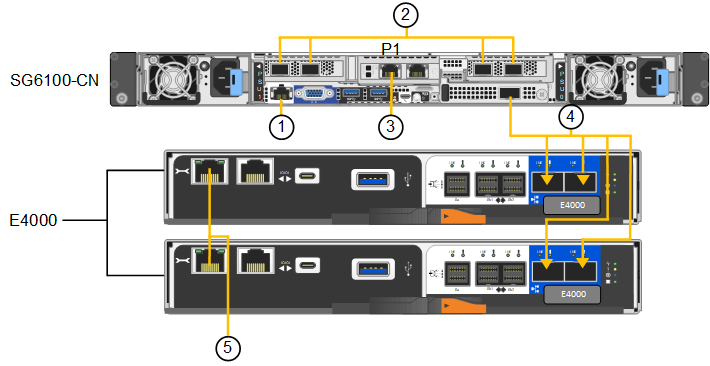

= Cable appliance
:icons: font
:imagesdir: ../media/

[.lead]
Connect the network ports on the appliance or controller to the Grid Network and optional Client Network for StorageGRID. For some appliances, you also connect the management port on the appliance to the service laptop or make connections between the controller management ports. 

[role="tabbed-block"]
====

.SG100 and SG1000
--

You must connect the management port on the appliance to the service laptop and connect the network ports on the appliance to the Grid Network and optional Client Network for StorageGRID.

.Before you begin

* You have an RJ-45 Ethernet cable for connecting the management port.
* You have one of the following options for the network ports. These items aren't provided with the appliance.
 ** One to four TwinAx cables for connecting the four network ports.
 ** For the SG100, one to four SFP+ or SFP28 transceivers if you plan to use optical cables for the ports.
 ** For the SG1000, one to four QSFP+ or QSFP28 transceivers if you plan to use optical cables for the ports.

CAUTION: *Risk of exposure to laser radiation* -- Don't disassemble or remove any part of an SFP or QSFP transceiver. You might be exposed to laser radiation.

.About this task

The following figures show the ports on the back of the appliance.

SG100 port connections:

image::../media/sg100_connections.png[SG100 rear connectors]

SG1000 port connections:

image::../media/sg1000_connections.png[SG1000 port connections]

[cols="1a,2a,2a,3a" options="header"]
|===
| Callout | Port| Type of port| Use 

|1
|BMC management port on the appliance
|1-GbE (RJ-45)
|Connects to the network where you access the BMC interface.

|2
|Four network ports on the appliance
|
* For the SG100: 10/25-GbE
* For the SG1000: 10/25/40/100-GbE
|Connect to the Grid Network and the Client Network for StorageGRID.  See link:../installconfig/gathering-installation-information-sg100-and-sg1000.html#port-bond-modes[Port bond modes (Port bond modes (SG100 and SG1000)].

|3
|Admin Network port on the appliance (labeled P1 in the figures)
|1-GbE (RJ-45)

*Caution:* This port operates only at 1000 baseT/full and does not support 10- or 100-megabit speeds.
|Connects the appliance to the Admin Network for StorageGRID.

|
|Rightmost RJ-45 port on the appliance
|1-GbE (RJ-45)

*Caution:* This port operates only at 1000 baseT/full and does not support 10- or 100-megabit speeds.
|
* Can be bonded with management port 1 if you want a redundant connection to the Admin Network.
* Can be left disconnected and available for temporary local access (IP 169.254.0.1).
* During installation, can be used to connect the appliance to a service laptop if DHCP-assigned IP addresses aren't available.
|===

.Steps

. Connect the BMC management port on the appliance to the management network, using an Ethernet cable.
+
Although this connection is optional, it is recommended to facilitate support.

. Connect the network ports on the appliance to the appropriate network switches, using TwinAx cables or optical cables and transceivers.
+
See the following table for the equipment required for your hardware and link speed.
+
[cols="2a,2a" options="header"]
|===
| SG100 link speed (GbE)| Required equipment
|10
|SFP+ transceiver

|25
|SFP28 transceiver

h| SG1000 link speed (GbE) h| Required equipment
|10
|QSA and SFP+ transceiver

|25
|QSA and SFP28 transceiver

|40
|QSFP+ transceiver

|100
|QFSP28 transceiver
|===

* On models that support Autonegotiate as a port speed option, if Fixed port bonding mode is selected you can run the ports dedicated to the StorageGRID Grid network at a different speed than the ports dedicated to the Client network.

* On models that do not support Autonegotiate as a port speed option, all four network ports must use the same link speed. 

* If you plan to use Fixed port bond mode (default), connect the ports to the StorageGRID Grid and Client Networks, as shown in the table.
+
[cols="1a,2a" options="header"]
|===
| Port| Connects to...
|Port 1
|Client Network (optional)

|Port 2
|Grid Network

|Port 3
|Client Network (optional)

|Port 4
|Grid Network
|===

* If you plan to use the Aggregate port bond mode, connect one or more of the network ports to one or more switches. You should connect at least two of the four ports to avoid having a single point of failure. If you use more than one switch for a single LACP bond, the switches must support MLAG or equivalent.

. If you plan to use the Admin Network for StorageGRID, connect the Admin Network port on the appliance to the Admin Network, using an Ethernet cable.

--

.SG110 and SG1100
--

You connect the management port on the appliance to the service laptop and connect the network ports on the appliance to the Grid Network and optional Client Network for StorageGRID.

.Before you begin

* You have an RJ-45 Ethernet cable for connecting the management port.
* You have one of the following options for the network ports. These items aren't provided with the appliance.
 ** One to four TwinAx cables for connecting the four network ports.
 ** For the SG110, one to four SFP+ or SFP28 transceivers if you plan to use optical cables for the ports.
 ** For the SG1100, one to four QSFP+ or QSFP28 transceivers if you plan to use optical cables for the ports.

CAUTION: *Risk of exposure to laser radiation* -- Don't disassemble or remove any part of an SFP or QSFP transceiver. You might be exposed to laser radiation.

.About this task

The following figures show the ports on the back of the appliance.

SG110 port connections:

image::../media/sgf6112_connections.png[SG110 rear connectors]

SG1100 port connections:

[cols="1a,2a,2a,3a" options="header"]
|===
| Callout | Port| Type of port| Use

|1
|BMC management port on the appliance
|1-GbE (RJ-45)
|Connects to the network where you access the BMC interface.

|2
|Four network ports on the appliance
|
* For the SG110: 10/25-GbE
* For the SG1100: 10/25/40/100-GbE 
|Connect to the Grid Network and the Client Network for StorageGRID. See link:gathering-installation-information-sg110-and-sg1100.html#port-bond-modes[Port bond modes (SG110 and SG1100)]

|3
|Admin Network port on the appliance
|1-GbE (RJ-45)

*Important:* This port operates only at 1/10-GbE (RJ-45) and does not support 100-megabit speeds.
|Connects the appliance to the Admin Network for StorageGRID.

|
|Rightmost RJ-45 port on the appliance
|1-GbE (RJ-45)

*Important:* This port operates only at 1/10-GbE (RJ-45) and does not support 100-megabit speeds.
|
* Can be bonded with management port 1 if you want a redundant connection to the Admin Network.
* Can be left disconnected and available for temporary local access (IP 169.254.0.1).
* During installation, can be used to connect the appliance to a service laptop if DHCP-assigned IP addresses aren't available.
|===

.Steps

. Connect the BMC management port on the appliance to the management network, using an Ethernet cable.
+
Although this connection is optional, it is recommended to facilitate support.

. Connect the network ports on the appliance to the appropriate network switches, using TwinAx cables or optical cables and transceivers.
+
See the following table for the equipment required for your hardware and link speed.
+
[cols="2a,2a" options="header"]
|===
| SG110 link speed (GbE)| Required equipment
|10
|SFP+ transceiver

|25
|SFP28 transceiver

h| SG1100 link speed (GbE) h| Required equipment
|10
|QSA and SFP+ transceiver

|25
|QSA and SFP28 transceiver

|40
|QSFP+ transceiver

|100
|QFSP28 transceiver
|===

* On models that support Autonegotiate as a port speed option, if Fixed port bonding mode is selected you can run the ports dedicated to the StorageGRID Grid network at a different speed than the ports dedicated to the Client network.

* On models that do not support Autonegotiate as a port speed option, all four network ports must use the same link speed. 

* If you plan to use Fixed port bond mode (default), connect the ports to the StorageGRID Grid and Client Networks, as shown in the table.
+
[cols="1a,2a" options="header"]
|===
| Port| Connects to...
|Port 1
|Client Network (optional)

|Port 2
|Grid Network

|Port 3
|Client Network (optional)

|Port 4
|Grid Network
|===

* If you plan to use the Aggregate port bond mode, connect one or more of the network ports to one or more switches. You should connect at least two of the four ports to avoid having a single point of failure. If you use more than one switch for a single LACP bond, the switches must support MLAG or equivalent.

. If you plan to use the Admin Network for StorageGRID, connect the Admin Network port on the appliance to the Admin Network, using an Ethernet cable.

--

.SG5700
--

You connect the two controllers to each other, connect the management ports on each controller, and connect the 10/25-GbE ports on the E5700SG controller to the Grid Network and optional Client Network for StorageGRID.

.Before you begin

* You have unpacked the following items, which are included with the appliance:
 ** Two power cords.
 ** Two optical cables for the FC interconnect ports on the controllers.
 ** Eight SFP+ transceivers, which support either 10-GbE or 16-Gbps FC. The transceivers can be used with the two interconnect ports on both controllers and with the four 10/25-GbE network ports on the E5700SG controller, assuming you want the network ports to use a 10-GbE link speed.
* You have obtained the following items, which aren't included with the appliance:
 ** One to four optical cables for the 10/25-GbE ports you plan to use.
 ** One to four SFP28 transceivers, if you plan to use 25-GbE link speed.
 ** Ethernet cables for connecting the management ports.

CAUTION: *Risk of exposure to laser radiation* -- Don't disassemble or remove any part of an SFP transceiver. You might be exposed to laser radiation.

.About this task

The figures show the two controllers in the SG5760 and SG5760X, with the E2800 series storage controller on the top and the E5700SG controller on the bottom. In the SG5712 and SG5712X, the E2800 series storage controller is to the left of the E5700SG controller when viewed from the back.

SG5760 connections:

image::../media/sg5760_connections.gif[Connections on the SG5760 appliance]

SG5760X connections:

image::../media/sg5760X_connections.png[Connections on the SG5760X appliance]

[cols="1a,2a,2a,2a" options="header"]
|===
|Callout | Port| Type of port| Use
a|
1
a|
Two interconnect ports on each controller
a|
16Gb/s FC optical SFP+

a|
Connect the two controllers to each other.
a|
2
a|
Management port 1 on the E2800 series controller
a|
1-GbE (RJ-45)
a|
Connects to the network where you access SANtricity System Manager. You can use the Admin Network for StorageGRID or an independent management network.
a|
2
a|
Management port 2 on the E2800 series controller
a|
1-GbE (RJ-45)
a|
Reserved for technical support.
a|
3
a|
Management port 1 on the E5700SG controller
a|
1-GbE (RJ-45)
a|
Connects the E5700SG controller to the Admin Network for StorageGRID.
a|
3
a|
Management port 2 on the E5700SG controller
a|
1-GbE (RJ-45)
a|

* Can be bonded with management port 1 if you want a redundant connection to the Admin Network.
* Can be left unwired and available for temporary local access (IP 169.254.0.1).
* During installation, can be used to connect the E5700SG controller to a service laptop if DHCP-assigned IP addresses aren't available.

a|
4
a|
10/25-GbE ports 1-4 on the E5700SG controller
a|
10-GbE or 25-GbE

*Note:* The SFP+ transceivers included with the appliance support 10-GbE link speeds. If you want to use 25-GbE link speeds for the four network ports, you must provide SFP28 transceivers.

a|
Connect to the Grid Network and the Client Network for StorageGRID. See link:gathering-installation-information-sg5700.html#port-bond-modes[Port bond modes (E5700SG controller)].
|===

.Steps

. Connect the E2800 controller to the E5700SG controller, using two optical cables and four of the eight SFP+ transceivers.
+
[cols="1a,1a" options="header"]
|===
| Connect this port...| To this port...
a|
Interconnect port 1 on the E2800 controller
a|
Interconnect port 1 on the E5700SG controller
a|
Interconnect port 2 on the E2800 controller
a|
Interconnect port 2 on the E5700SG controller
|===

. If you plan to use SANtricity System Manager, connect management port 1 (P1) on the E2800 controller (the RJ-45 port on the left) to the management network for SANtricity System Manager, using an Ethernet cable.
+
Don't use management port 2 (P2) on the E2800 controller (the RJ-45 port on the right). This port is reserved for technical support.

. If you plan to use the Admin Network for StorageGRID, connect management port 1 on the E5700SG controller (the RJ-45 port on the left) to the Admin Network, using an Ethernet cable.
+
If you plan to use active-backup network bond mode for the Admin Network, connect management port 2 on the E5700SG controller (the RJ-45 port on the right) to the Admin Network, using an Ethernet cable.

. Connect the 10/25-GbE ports on the E5700SG controller to the appropriate network switches, using optical cables and SFP+ or SFP28 transceivers.
+
NOTE: Install SFP+ transceivers if you plan to use 10-GbE link speeds. Install SFP28 transceivers if you plan to use 25-GbE link speeds.

* On models that support Autonegotiate as a port speed option, if Fixed port bonding mode is selected you can run the ports dedicated to the StorageGRID Grid network at a different speed than the ports dedicated to the Client network.

* On models that do not support Autonegotiate as a port speed option, all four network ports must use the same link speed. 
 
* If you plan to use Fixed port bond mode (default), connect the ports to the StorageGRID Grid and Client Networks, as shown in the table.
+
[cols="1a,1a" options="header"]
|===
| Port| Connects to...
a|
Port 1
a|
Client Network (optional)
a|
Port 2
a|
Grid Network
a|
Port 3
a|
Client Network (optional)
a|
Port 4
a|
Grid Network
|===

* If you plan to use the Aggregate port bond mode, connect one or more of the network ports to one or more switches. You should connect at least two of the four ports to avoid having a single point of failure. If you use more than one switch for a single LACP bond, the switches must support MLAG or equivalent.

--

.SG5800
--

You connect the two controllers to each other, connect the management ports on each controller, and connect the 10/25-GbE ports on the SG5800 controller to the Grid Network and optional Client Network for StorageGRID.

.Before you begin

* You have unpacked the following items, which are included with the appliance:
 ** Two power cords.
 ** Two cables for the iSCSI interconnect ports on the controllers.
* You have obtained the following items, which aren't included with the appliance:
 ** One to four optical or copper cables for the 10/25-GbE ports you plan to use.
 ** One to eight SFP+ transceivers, if you plan to use optical cables and 10-GbE link speed.
 ** One to eight SFP28 transceivers, if you plan to use optical cables and 25-GbE link speed.
 ** Ethernet cables for connecting the management ports.

CAUTION: *Risk of exposure to laser radiation* -- Don't disassemble or remove any part of an SFP transceiver. You might be exposed to laser radiation.

.About this task

The figures show the two controllers in the SG5860, with the E4000 series storage controller on the top and the SG5800 controller on the bottom. In the SG5812, the E4000 series storage controller is to the left of the SG5800 controller when viewed from the back.

SG5860 connections:

[cols="1a,2a,2a,2a" options="header"]
|===
|Callout | Port| Type of port| Use
a|
1
a|
Two interconnect ports on each controller
a|
25GbE iSCSI (SFP28)

a|
Connect the two controllers to each other.
a|
2
a|
Management port 1 on the E4000 series controller
a|
1-GbE (RJ-45)
a|
Connects to the network where you access SANtricity System Manager. You can use the Admin Network for StorageGRID or an independent management network.
a|
3
a|
Management port 1 on the SG5800 controller
a|
1-GbE (RJ-45)
a|
Connects the SG5800 controller to the Admin Network for StorageGRID.
a|
4
a|
10/25-GbE ports 1-4 on the SG5800 controller
a|
10-GbE or 25-GbE

a|
Connect to the Grid Network and the Client Network for StorageGRID. See link:gathering-installation-information-sg5800.html#port-bond-modes[Port bond modes (SG5800 controller)].
|===

.Steps

. Connect the E4000 controller to the SG5800 controller, using the two provided cables.
+
[cols="1a,1a" options="header"]
|===
| Connect this port...| To this port...
a|
Interconnect port 1 on the E4000 controller
a|
Interconnect port 1 on the SG5800 controller
a|
Interconnect port 2 on the E4000 controller
a|
Interconnect port 2 on the SG5800 controller
|===

. Optionally, connect management port 1 (P1) on the E4000 controller (the RJ-45 port on the left) to the management network for SANtricity System Manager using an Ethernet cable.

. If you plan to use the Admin Network for StorageGRID, connect management port 1 on the SG5800 controller (the RJ-45 port on the left) to the Admin Network, using an Ethernet cable.

. Connect the 10/25-GbE ports on the SG5800 controller to the appropriate network switches, using copper cables or optical cables and SFP+ or SFP28 transceivers.
+
NOTE: Install SFP+ transceivers if you plan to use 10-GbE link speeds. Install SFP28 transceivers if you plan to use 25-GbE link speeds.

* On models that support Autonegotiate as a port speed option, if Fixed port bonding mode is selected you can run the ports dedicated to the StorageGRID Grid network at a different speed than the ports dedicated to the Client network.

* On models that do not support Autonegotiate as a port speed option, all four network ports must use the same link speed. 
 
* If you plan to use Fixed port bond mode (default), connect the ports to the StorageGRID Grid and Client Networks, as shown in the table.
+
[cols="1a,1a" options="header"]
|===
| Port| Connects to...
a|
Port 1
a|
Client Network (optional)
a|
Port 2
a|
Grid Network
a|
Port 3
a|
Client Network (optional)
a|
Port 4
a|
Grid Network
|===

* If you plan to use the Aggregate port bond mode, connect one or more of the network ports to one or more switches. You should connect at least two of the four ports to avoid having a single point of failure. If you use more than one switch for a single LACP bond, the switches must support MLAG or equivalent.

--

.SG6000
--

You connect the storage controllers to the SG6000-CN controller, connect the management ports on all three controllers, and connect the network ports on the SG6000-CN controller to the Grid Network and optional Client Network for StorageGRID.

.Before you begin

* You have the four optical cables provided with the appliance for connecting the two storage controllers to the SG6000-CN controller.
* You have RJ-45 Ethernet cables (four minimum) for connecting the management ports.
* You have one of the following options for the network ports. These items aren't provided with the appliance.
 ** One to four TwinAx cables for connecting the four network ports.
 ** One to four SFP+ or SFP28 transceivers if you plan to use optical cables for the ports.
+
CAUTION: *Risk of exposure to laser radiation* -- Don't disassemble or remove any part of an SFP transceiver. You might be exposed to laser radiation.

.About this task

The following figures show the three controllers in the SG6060 and SG6060X appliances, with the SG6000-CN compute controller on the top and the two E2800 storage controllers on the bottom. The SG6060 uses E2800A controllers, and the SG6060X uses one of two E2800B controller versions. 

NOTE: Both versions of the E2800 controller have identical specifications and function except for the location of the interconnect ports.

CAUTION: Don't use an E2800A and E2800B controller in the same appliance. 

SG6060 connections:

image::../media/sg6000_e2800_connections.png[SG6060 to E2800A Connections]

SG6060X connections:

* Version 1
+
image::../media/sg6000x_e2800B_connections.png[SG6060 to E2800B Connections]
* Version 2
+
NOTE: If the FC transceivers in the E2800B controller are installed in the upper FC connection ports (6), move them to the lower-right FC connection ports (7).
+
image::../media/sg6000x_e2800B2_connections.png[SG6060 to E2800B Connections]

The following figure shows the three controllers in the SGF6024 appliance, with the SG6000-CN compute controller on the top and the two EF570 storage controllers side by side below the compute controller.

SGF6024 connections:

image::../media/sg6000_ef570_connections.png[SG6000 to SGF570 Connections]

[cols="1a,2a,2a,3a" options="header"]
|===
| Callout | Port| Type of port| Use
|1
|BMC management port on the SG6000-CN controller
|1-GbE (RJ-45)
|Connects to the network where you access the BMC interface.

|2
|FC connection ports:

* 4 on the SG6000-CN controller
* 2 on each storage controller
|16-Gb/s FC optical SFP+
|Connect each storage controller to the SG6000-CN controller.

|3
|Four network ports on the SG6000-CN controller
|10/25-GbE
|Connect to the Grid Network and the Client Network for StorageGRID. See link:../installconfig/gathering-installation-information-sg6000.html#port-bond-modes[Port bond modes (SG6000-CN controller)].

|4
|Admin Network port on the SG6000-CN controller (labeled P1 in the figure)
|1-GbE (RJ-45)

*Caution:* This port operates only at 1000 baseT/full and does not support 10- or 100-megabit speeds.
|Connects the SG6000-CN controller to the Admin Network for StorageGRID.

|
|Rightmost RJ-45 port on the SG6000-CN controller
|1-GbE (RJ-45)

*Caution:* This port operates only at 1000 baseT/full and does not support 10- or 100-megabit speeds.
|
* Can be bonded with management port 1 if you want a redundant connection to the Admin Network.
* Can be left unwired and available for temporary local access (IP 169.254.0.1).
* During installation, can be used to connect the SG6000-CN controller to a service laptop if DHCP-assigned IP addresses aren't available.

|5
|Management port 1 on each storage controller
|1-GbE (RJ-45)
|Connects to the network where you access SANtricity System Manager.

|
|Management port 2 on each storage controller
|1-GbE (RJ-45)
|Reserved for technical support.
|===

.Steps

. Connect the BMC management port on the SG6000-CN controller to the management network, using an Ethernet cable.
+
Although this connection is optional, it is recommended to facilitate support.

. Connect the two FC ports on each storage controller to the FC ports on the SG6000-CN controller, using four optical cables and four SFP+ transceivers for the storage controllers.
. Connect the network ports on the SG6000-CN controller to the appropriate network switches, using TwinAx cables or optical cables and SFP+ or SFP28 transceivers.
+
NOTE: Install SFP+ transceivers if you plan to use 10-GbE link speeds. Install SFP28 transceivers if you plan to use 25-GbE link speeds.

* On models that support Autonegotiate as a port speed option, if Fixed port bonding mode is selected you can run the ports dedicated to the StorageGRID Grid network at a different speed than the ports dedicated to the Client network.

* On models that do not support Autonegotiate as a port speed option, all four network ports must use the same link speed. 
* If you plan to use Fixed port bond mode (default), connect the ports to the StorageGRID Grid and Client Networks, as shown in the table.
+
[cols="1a,2a" options="header"]
|===
| Port| Connects to...
a|
Port 1
a|
Client Network (optional)
a|
Port 2
a|
Grid Network
a|
Port 3
a|
Client Network (optional)
a|
Port 4
a|
Grid Network
|===

 ** If you plan to use the Aggregate port bond mode, connect one or more of the network ports to one or more switches. You should connect at least two of the four ports to avoid having a single point of failure. If you use more than one switch for a single LACP bond, the switches must support MLAG or equivalent.

. If you plan to use the Admin Network for StorageGRID, connect the Admin Network port on the SG6000-CN controller to the Admin Network, using an Ethernet cable.

. If you plan to use the management network for SANtricity System Manager, connect management port 1 (P1) on each storage controller (the RJ-45 port on the left) to the management network for SANtricity System Manager, using an Ethernet cable.

+
Don't use management port 2 (P2) on the storage controllers (the RJ-45 port on the right). This port is reserved for technical support.

--

.SG6100
--

You connect the management port on the appliance to the service laptop and connect the network ports on the appliance to the Grid Network and optional Client Network for StorageGRID.

.Before you begin

* SG6160 only: You have the 100GbE to 4x25GbE breakout cable provided with the appliance for connecting the two storage controllers to the SG6100-CN controller.
* You have RJ-45 Ethernet cables:
** One RJ-45 cable for connecting the management port.
** SG6160 only: Up to four additional RJ-45 Ethernet cables for the optional ports you plan to use, including the second Admin port and the BMC port on the SG6100-CN, and the maintenance ports on each of the two E4000 controllers.
* You have one of the following options for the network ports. These items aren't provided with the appliance.
 ** One to four TwinAx cables for connecting the four network ports.
 ** One to eight SFP+ or SFP28 transceivers if you plan to use optical cables for the ports.

CAUTION: *Risk of exposure to laser radiation* -- Don't disassemble or remove any part of an SFP transceiver. You might be exposed to laser radiation.

.About this task

The following figures show the ports on the back of the SGF6112 and the three controllers in the SG6160 appliance. The SG6160 appliance includes a SG6100-CN compute controller on top and two E4000 storage controllers on the bottom.

SGF6112 connections:

image::../media/sgf6112_connections.png[SGF6112 rear connectors]

SG6160 connections:

[cols="1a,2a,2a,3a" options="header"]
|===
| Callout | Port| Type of port| Use

|1
|BMC management port on the appliance
|1-GbE (RJ-45)
|Connects to the network where you access the BMC interface.

|2
|Four network ports on the SG6100-CN controller
|* Four 10/25-GbE network ports on the appliance 
* Four 10/25/40/100-GbE network ports with optional 100G NIC SKU (SG6160 only)
|Connect to the Grid Network and the Client Network for StorageGRID. See link:gathering-installation-information-sg6100.html#port-bond-modes[Port bond modes (SG6100)]

|3
|Admin Network port on the appliance (labeled P1 in the figure)
|1/10-GbE (RJ-45)

*Important:* This port operates only at 1/10-GbE (RJ-45) and does not support 100-megabit speeds.
|Connects the appliance to the Admin Network for StorageGRID.

|
|Rightmost RJ-45 port on the appliance
|1/10-GbE (RJ-45)

*Caution:* This port operates only at 1/10-GbE (RJ-45) and does not support 100-megabit speeds.
|
* Can be bonded with management port 1 if you want a redundant connection to the Admin Network.
* Can be left disconnected and available for temporary local access (IP 169.254.0.1).
* During installation, can be used to connect the appliance to a service laptop if DHCP-assigned IP addresses aren't available.

|4 (SG6160 only)
|Five total connection ports
|
* One 100GbE port on the SG6100-CN
* Two 10/25GbE ports on each of the storage controllers
|Connect each storage controller to the SG6100-CN controller.

|5 (SG6160 only)
|Management port 1 on each storage controller
|1-GbE (RJ-45)
|Connects to the network where you access SANtricity System Manager.

|
|Management port 2 on each storage controller
|1-GbE (RJ-45)
|Connects to the network where you access SANtricity System Manager.
|===

.Steps

. Connect the BMC management port on the appliance to the management network, using an Ethernet cable.
+
Although this connection is optional, it is recommended to facilitate support.
. Connect the two interconnect ports on each storage controller to the 100GbE port on the SG6100-CN controller, using one 100-GbE QSFP28 to 4x25-GbE SFP28 cable.
. Connect the network ports on the appliance to the appropriate network switches, using TwinAx cables or optical cables and transceivers.
+
[cols="2a,2a" options="header"]
|===
| Link speed (GbE)| Required equipment
|10
|SFP+ transceiver

|25
|SFP28 transceiver

|===

* Grid and Client network ports can be run at different speeds only if Autonegotiate is selected as the link speed, and Fixed is selected as the port bond mode. Otherwise, all four ports will run at the same speed.

* If you plan to use Fixed port bond mode (default), connect the ports to the StorageGRID Grid and Client Networks, as shown in the table.
+
[cols="1a,2a" options="header"]
|===
| Port| Connects to...
|Port 1
|Client Network (optional)

|Port 2
|Grid Network

|Port 3
|Client Network (optional)

|Port 4
|Grid Network
|===

* If you plan to use the Aggregate port bond mode, connect one or more of the network ports to one or more switches. You should connect at least two of the four ports to avoid having a single point of failure. If you use more than one switch for a single LACP bond, the switches must support MLAG or equivalent.

. If you plan to use the Admin Network for StorageGRID, connect the Admin Network port on the appliance to the Admin Network, using an Ethernet cable.

. If your appliance includes an expansion shelf, see the link:../sg6100/adding-expansion-shelf-to-deployed-sg6160.html[instructions for adding an expansion shelf to a deployed SG6160] for cabling information.
--

====

// 2025 JAN 8, storagegrid-appliance-issue-23
// 2024 JUL 16, SGRIDDOC-75