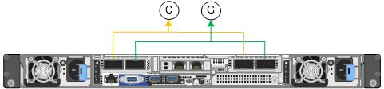
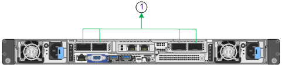
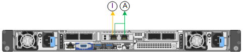

= Gather network information (SG110 and SG1100)
:icons: font
:imagesdir: ../media/

[.lead]
Using the tables, record the required information for each network you connect to the appliance. These values are required to install and configure the hardware.

TIP: Instead of using the tables, use the workbook provided with ConfigBuilder. Using the ConfigBuilder workbook allows you to upload your system information and generate a JSON file to automatically complete some configuration steps in the StorageGRID Appliance Installer. See link:automating-appliance-installation-and-configuration.html[Automate appliance installation and configuration].

== Check StorageGRID version

Before installing an SG110 or SG1100 services appliance, confirm your StorageGRID system is using a required version of StorageGRID software.

[cols="1a,2a" options="header"]
|===
| Appliance| Required StorageGRID version
| SG1100
| 11.8 or later (latest hotfix recommended)
| SG110
| 11.8 or later (latest hotfix recommended)
|===

== Administration and maintenance ports

The Admin Network for StorageGRID is an optional network, used for system administration and maintenance. The appliance connects to the Admin Network using the following 1/10-GbE management ports on the appliance.

SG110 RJ-45 ports:

image::../media/sg6100_rj_45_ports_circled.png[SG110 RJ-45 ports]

SG1100 RJ-45 ports:

[cols="2a,1a" options="header"]
|===
| Information needed| Your value
|
Admin Network enabled
|
Choose one:

* No
* Yes (default)

|
Network bond mode
|
Choose one:

* Independent (default)
* Active-Backup

|
Switch port for the left port circled in the diagram (default active port for Independent network bond mode)
|

|
Switch port for the right port circled in the diagram (Active-Backup network bond mode only)
|

|
DHCP-assigned IP address for the Admin Network port, if available after power on

*Note:* Contact your network administrator for the Admin Network port DHCP-assigned IP address.

|

* IPv4 address (CIDR):
* Gateway:

|
Static IP address you plan to use for the appliance node on the Admin Network

*Note:* If your network does not have a gateway, specify the same static IPv4 address for the gateway.

|

* IPv4 address (CIDR):
* Gateway:

|
Admin Network subnets (CIDR)
a|

|===

== Networking ports

The four networking ports on the appliance connect to the StorageGRID Grid Network and the optional Client Network.

[cols="2a,1a" options="header"]
|===
| Information needed| Your value
|
Link speed

|
For the SG110, choose one of the following:

* Auto (default)
* 10 GbE
* 25 GbE

For the SG1100, choose one of the following:

* Auto (default)
* 10 GbE
* 25 GbE
* 40 GbE
* 100 GbE

*Note:* For the SG1100, 10- and 25-GbE speeds require the use of QSA adapters.

|
Port bond mode

|
Choose one:

* Fixed (default)
* Aggregate

|
Switch port for port 1 (Client Network for Fixed mode)

|

|
Switch port for port 2 (Grid Network for Fixed mode)

|

|
Switch port for port 3 (Client Network for Fixed mode)

|

|
Switch port for port 4 (Grid Network for Fixed mode)

a|

|===

== Grid Network ports

The Grid Network for StorageGRID is a required network, used for all internal StorageGRID traffic. The appliance connects to the Grid Network using the four network ports.

[cols="2a,1a" options="header"]
|===
| Information needed| Your value
a|
Network bond mode
a|
Choose one:

* Active-Backup (default)
* LACP (802.3ad)

a|
VLAN tagging enabled
a|
Choose one:

* No (default)
* Yes

a|
VLAN tag (if VLAN tagging is enabled)

a|
Enter a value between 0 and 4095:
a|
DHCP-assigned IP address for the Grid Network, if available after power on
a|

* IPv4 address (CIDR):
* Gateway:

a|
Static IP address you plan to use for the appliance node on the Grid Network

*Note:* If your network does not have a gateway, specify the same static IPv4 address for the gateway.

a|

* IPv4 address (CIDR):
* Gateway:

a|
Grid Network subnets (CIDRs)
a|

a|
Maximum transmission unit (MTU) setting (optional)You can use the default value of 1500, or set the MTU to a value suitable for jumbo frames, such as 9000.

a|

|===

== Client Network ports

The Client Network for StorageGRID is an optional network, typically used to provide client protocol access to the grid. The appliance connects to the Client Network using the four network ports.

[cols="2a,1a" options="header"]
|===
| Information needed| Your value
a|
Client Network enabled
a|
Choose one:

* No (default)
* Yes

a|
Network bond mode
a|
Choose one:

* Active-Backup (default)
* LACP (802.3ad)

a|
VLAN tagging enabled
a|
Choose one:

* No (default)
* Yes

a|
VLAN tag (If VLAN tagging is enabled)

a|
Enter a value between 0 and 4095:

a|
DHCP-assigned IP address for the Client Network, if available after power on
a|

* IPv4 address (CIDR):
* Gateway:

a|
Static IP address you plan to use for the appliance node on the Client Network

*Note:* If the Client Network is enabled, the default route on the appliance will use the gateway specified here.

a|

* IPv4 address (CIDR):
* Gateway:

|===

== BMC management network ports

You can access the BMC interface on the services appliance using the 1-GbE management port circled in the diagram. This port supports remote management of the controller hardware over Ethernet using the Intelligent Platform Management Interface (IPMI) standard.

include::../_include/enable-disable-ipmi.adoc[]

SG110 BMC management port:

image::../media/sgf6112_cn_bmc_management_port.png[SG110 management port]

SG1100 BMC management port:

[cols="2a,1a" options="header"]
|===
| Information needed| Your value

| Ethernet switch port you will connect to the BMC management port (circled in the diagram)
|

| DHCP-assigned IP address for the BMC management network, if available after power on
|
* IPv4 address (CIDR):
* Gateway:

| Static IP address you plan to use for the BMC management port
| 
* IPv4 address (CIDR):
* Gateway:

|===

== Port bond modes

When link:configuring-network-links.html[configuring network links] for the SG110 and SG1100 appliances, you can use port bonding for the ports that connect to the Grid Network and optional Client Network, and the 1-GbE1/10-GbE management ports that connect to the optional Admin Network. Port bonding helps protect your data by providing redundant paths between StorageGRID networks and the appliance.

=== Network bond modes

The networking ports on the services appliance support Fixed port bond mode or Aggregate port bond mode for the Grid Network and Client Network connections.

==== Fixed port bond mode

Fixed port bond mode is the default configuration for the networking ports. The figures show how the network ports on the SG1100 or SG110 are bonded in fixed port bond mode.

SG110: 

image::../media/sgf6112_fixed_port.png[SG110 Fixed Port Bond Mode]

SG1100:

[cols="1a,3a" options=header] 
|===
| Callout
| Which ports are bonded

| C
| Ports 1 and 3 are bonded together for the Client Network, if this network is used.

| G
| Ports 2 and 4 are bonded together for the Grid Network.
|===

When using Fixed port bond mode, the ports can be bonded using active-backup mode or Link Aggregation Control Protocol mode (LACP 802.3ad).

* In active-backup mode (default), only one port is active at a time. If the active port fails, its backup port automatically provides a failover connection. Port 4 provides a backup path for port 2 (Grid Network), and port 3 provides a backup path for port 1 (Client Network).
* In LACP mode, each pair of ports forms a logical channel between the services appliance and the network, allowing for higher throughput. If one port fails, the other port continues to provide the channel. Throughput is reduced, but connectivity is not impacted.

NOTE: If you don't need redundant connections, you can use only one port for each network. However, be aware that the *Services appliance link down* alert might be triggered in the Grid Manager after StorageGRID is installed, indicating that a cable is unplugged. You can safely disable this alert rule.

==== Aggregate port bond mode

Aggregate port bond mode significantly increases the throughput for each StorageGRID network and provides additional failover paths. These figures show how the network ports are bonded in aggregate port bond mode.

SG110:

image::../media/sgf6112_aggregate_ports.png[SG110 aggregate port bond mode]

SG1100:

[cols="1a,3a" options=header] 
|===
| Callout
| Which ports are bonded

| 1
| All connected ports are grouped in a single LACP bond, allowing all ports to be used for Grid Network and Client Network traffic.
|===

If you plan to use aggregate port bond mode:

* You must use LACP network bond mode.
* You must specify a unique VLAN tag for each network. This VLAN tag will be added to each network packet to ensure that network traffic is routed to the correct network.
* The ports must be connected to switches that can support VLAN and LACP. If multiple switches are participating in the LACP bond, the switches must support multi-chassis link aggregation groups (MLAG), or equivalent.
* You understand how to configure the switches to use VLAN, LACP, and MLAG, or equivalent.

If you don't want to use all four ports, you can use one, two, or three ports. Using more than one port maximizes the chance that some network connectivity will remain available if one of the ports fails.

NOTE: If you choose to use fewer than four network ports, be aware that a *Services appliance link down* alert might be triggered in the Grid Manager after the appliance node is installed, indicating that a cable is unplugged. You can safely disable this alert rule for the triggered alert.

=== Network bond modes for management ports

For the two 1/10-GbE management ports on the services appliance, you can choose Independent network bond mode or Active-Backup network bond mode to connect to the optional Admin Network. These figures show how the management ports on the appliances are bonded in network bond mode for the Admin Network.

SG110:

image::../media/sgf6112_bonded_management_ports.png[SG110 Bonded Network Management Ports]

SG1100:

[cols="1a,3a" options="header"]
|===
| Callout| Network bond mode
a|
A
a|
Active-Backup mode. Both management ports are bonded into one logical management port connected to the Admin Network.
a|
I
a|
Independent mode. The port on the left is connected to the Admin Network. The port on the right is available for temporary local connections (IP address 169.254.0.1).
|===

In Independent mode, only the management port on the left is connected to the Admin Network. This mode does not provide a redundant path. The management port on the right is unconnected and available for temporary local connections (uses IP address 169.254.0.1)

In Active-Backup mode, both management ports are connected to the Admin Network. Only one port is active at a time. If the active port fails, its backup port automatically provides a failover connection. Bonding these two physical ports into one logical management port provides a redundant path to the Admin Network.

NOTE: If you need to make a temporary local connection to the services appliance when the 1/10-GbE management ports are configured for Active-Backup mode, remove the cables from both management ports, plug your temporary cable into the management port on the right, and access the appliance using IP address 169.254.0.1.

.Related information

* link:cabling-appliance.html[Cable appliance]

* link:setting-ip-configuration.html[Configure StorageGRID IP addresses]
