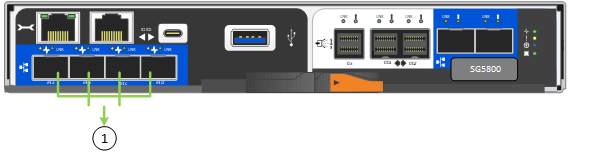

= Gather network information (SG5800)
:icons: font
:imagesdir: ../media/

[.lead]
Using the tables, record the required information for each network you connect to the appliance. These values are required to install and configure the hardware.

TIP: Instead of using the tables, use the workbook provided with ConfigBuilder. Using the ConfigBuilder workbook allows you to upload your system information and generate a JSON file to automatically complete some configuration steps in the StorageGRID Appliance Installer. See link:automating-appliance-installation-and-configuration.html[Automate appliance installation and configuration].

== Information needed to connect to SANtricity System Manager on E4000 controller

You will use the SANtricity System Manager to connect the E4000 series controller to the management network.

[cols="2a,1a" options="header"]"]
|===
| Information needed| Your value
a|
Ethernet switch port you will connect to management port 1
a|

a|
MAC address for management port 1 (printed on a label near port P1)
a|

a|
DHCP-assigned IP address for management port 1, if available after power on

*Note:* If the network you will connect to the E4000 controller includes a DHCP server, the network administrator can use the MAC address to determine the IP address that was assigned by the DHCP server.

a|

a|
Speed and duplex mode

*Note:* You must make sure the Ethernet switch for the SANtricity System Manager management network is set to autonegotiate.

a|
Must be:

* Autonegotiate (default)

a|
IP address format
a|
Choose one:

* IPv4
* IPv6

a|
Static IP address you plan to use for the appliance on the management network
a|
For IPv4:

* IPv4 address:
* Subnet mask:
* Gateway:

For IPv6:

* IPv6 address:
* Routable IP address:
* E4000 controller router IP address:
|===

== Information needed to connect SG5800 controller to Admin Network

The Admin Network for StorageGRID is an optional network, used for system administration and maintenance. The appliance connects to the Admin Network using the 1-GbE management port on the SG5800 controller.

[cols="2a,1a" options="header"]
|===
| Information needed| Your value
a|
Admin Network enabled
a|
Choose one:

* No
* Yes (default)

a|
Switch port for port 1
a|

a|
Switch port for port 2 (Active-Backup network bond mode only)
a|

a|
DHCP-assigned IP address for management port 1, if available after power on

*Note:* If the Admin Network includes a DHCP server, you can determine the DHCP-assigned IP address by using the MAC address to look up the assigned IP.

a|

* IPv4 address (CIDR):
* Gateway:

a|
Static IP address you plan to use for the appliance Storage Node on the Admin Network

*Note:* If your network does not have a gateway, specify the same static IPv4 address for the gateway.

a|

* IPv4 address (CIDR):
* Gateway:

a|
Admin Network subnets (CIDR)
a|
|===

== Information needed to connect and configure 10/25-GbE ports on SG5800 controller

The four 10/25-GbE ports on the SG5800 controller connect to the StorageGRID Grid Network and Client Network.

NOTE: See link:gathering-installation-information-sg5800.html#port-bond-modes[Port bond modes (SG5800 controller)].

[cols="2a,1a" options="header"]
|===
| Information needed| Your value
a|
Link speed

a|
Choose one:

* Auto (default)
* 10 GbE (default)
* 25 GbE

a|
Port bond mode

a|
Choose one:

* Fixed (default)
* Aggregate

a|
Switch port for port 1 (Client Network)

a|

a|
Switch port for port 2 (Grid Network)

a|

a|
Switch port for port 3 (Client Network)

a|

a|
Switch port for port 4 (Grid Network)

a|

|===

== Information needed to connect SG5800 controller to Grid Network

The Grid Network for StorageGRID is a required network, used for all internal StorageGRID traffic. The appliance connects to the Grid Network using the 10/25-GbE ports on the SG5800 controller.

NOTE: See link:gathering-installation-information-sg5800.html#port-bond-modes[Port bond modes (SG5800 controller)].

[cols="2a,1a" options="header"]
|===
| Information needed| Your value
a|
Network bond mode
a|
Choose one:

* Active-Backup (default)
* LACP (802.3ad)

a|
VLAN tagging enabled
a|
Choose one:

* No (default)
* Yes

a|
VLAN tag(if VLAN tagging is enabled)

a|
Enter a value between 0 and 4095:
a|
DHCP-assigned IP address for the Grid Network, if available after power on

a|

* IPv4 address (CIDR):
* Gateway:

a|
Static IP address you plan to use for the appliance Storage Node on the Grid Network

*Note:* If your network does not have a gateway, specify the same static IPv4 address for the gateway.

a|

* IPv4 address (CIDR):
* Gateway:

a|
Grid Network subnets (CIDR)

*Note:* If the Client Network is not enabled, the default route on the controller will use the gateway specified here.

a|

|===

== Information needed to connect SG5800 controller to Client Network

The Client Network for StorageGRID is an optional network, typically used to provide client protocol access to the grid. The appliance connects to the Client Network using the 10/25-GbE ports on the SG5800 controller.

NOTE: See link:gathering-installation-information-sg5800.html#port-bond-modes[Port bond modes (SG5800 controller)].

[cols="2a,1a" options="header"]
|===
| Information needed| Your value
a|
Client Network enabled
a|
Choose one:

* No (default)
* Yes

a|
Network bond mode
a|
Choose one:

* Active-Backup (default)
* LACP (802.3ad)

a|
VLAN tagging enabled
a|
Choose one:

* No (default)
* Yes

a|
VLAN tag

(if VLAN tagging is enabled)

a|
Enter a value between 0 and 4095:
a|
DHCP-assigned IP address for the Client Network, if available after power on
a|

* IPv4 address (CIDR):
* Gateway:

a|
Static IP address you plan to use for the appliance Storage Node on the Client Network

*Note:* If the Client Network is enabled, the default route on the controller will use the gateway specified here.

a|

* IPv4 address (CIDR):
* Gateway:

|===

== Port bond modes

When link:configuring-network-links.html[configuring network links] for the SG5800 controller, you can use port bonding for the 10/25-GbE ports that connect to the Grid Network and optional Client Network. Port bonding helps protect your data by providing redundant paths between StorageGRID networks and the appliance. The 10/25-GbE networking ports on the SG5800 controller support Fixed port bond mode or Aggregate port bond mode for the Grid Network and Client Network connections.

=== Fixed port bond mode

Fixed mode is the default configuration for the 10/25-GbE networking ports.

image::../media/e5800sg_fixed_port.png[Ports used for Fixed port bond mode]

[cols="1a,3a" options=header] 
|===
| Callout| Which ports are bonded
a|
C
a|
Ports 1 and 3 are bonded together for the Client Network, if this network is used.
a|
G
a|
Ports 2 and 4 are bonded together for the Grid Network.
|===
When using Fixed port bond mode, you can use one of two network bond modes: Active-Backup or Link Aggregation Control Protocol (LACP).

* In Active-Backup mode (default), only one port is active at a time. If the active port fails, its backup port automatically provides a failover connection. Port 4 provides a backup path for port 2 (Grid Network), and port 3 provides a backup path for port 1 (Client Network).
* In LACP mode, each pair of ports forms a logical channel between the controller and the network, allowing for higher throughput. If one port fails, the other port continues to provide the channel. Throughput is reduced, but connectivity is not impacted.

NOTE: If you don't need redundant connections, you can use only one port for each network. However, be aware that an alarm will be raised in the Grid Manager after StorageGRID is installed, indicating that a cable is unplugged. You can safely acknowledge this alarm to clear it.

=== Aggregate port bond mode

Aggregate port bond mode significantly increases the throughout for each StorageGRID network and provides additional failover paths.

[cols="1a,3a" options=header] 
|===
| Callout| Which ports are bonded
a|
1
a|
All connected ports are grouped in a single LACP bond, allowing all ports to be used for Grid Network and Client Network traffic.
|===
If you plan to use Aggregate port bond mode:

* You must use LACP network bond mode.
* You must specify a unique VLAN tag for each network. This VLAN tag will be added to each network packet to ensure that network traffic is routed to the correct network.
* The ports must be connected to switches that can support VLAN and LACP. If multiple switches are participating in the LACP bond, the switches must support multi-chassis link aggregation groups (MLAG), or equivalent.
* You understand how to configure the switches to use VLAN, LACP, and MLAG, or equivalent.

If you don't want to use all four 10/25-GbE ports, you can use one, two, or three ports. Using more than one port maximizes the chance that some network connectivity will remain available if one of the 10/25-GbE ports fails.

NOTE: If you choose to use fewer than four ports, be aware that one or more alarms will be raised in the Grid Manager after StorageGRID is installed, indicating that cables are unplugged. You can safely acknowledge the alarms to clear them.

.Related information

* link:cabling-appliance-sg5800.html[Cable appliance (SG5800)]

* link:gathering-installation-information-sg5800.html#port-bond-modes[Port bond modes (SG5800 controller)]

* link:configuring-hardware.html[Configure hardware (SG5800)]
