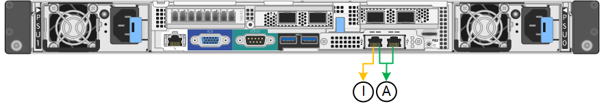

= Gather network information (SG6000)
:icons: font
:imagesdir: ../media/

[.lead]
Using the tables, record the required information for each network you connect to the appliance. These values are required to install and configure the hardware.

TIP: Instead of using the tables, use the workbook provided with ConfigBuilder. Using the ConfigBuilder workbook allows you to upload your system information and generate a JSON file to automatically complete some configuration steps in the StorageGRID Appliance Installer. See link:automating-appliance-installation-and-configuration.html[Automate appliance installation and configuration].

== Information needed to connect to SANtricity System Manager on storage controllers

You connect both of the storage controllers in the appliance (either the E2800 series controllers or the EF570 controllers) to the management network you will use for SANtricity System Manager. The controllers are located in each appliance as follows:

* SG6060 and SG6060X: Controller A is on the top, and controller B is on the bottom.
* SGF6024: Controller A is on the left, and controller B is on the right.

[cols="2a,1a,1a" options="header"]
|===
| Information needed| Your value for controller A| Your value for controller B
a|
Ethernet switch port you will connect to management port 1 (labeled as P1 on the controller)
a|

a|

a|
MAC address for management port 1 (printed on a label near port P1)
a|

a|

a|
DHCP-assigned IP address for management port 1, if available after power on

*Note:* If the network you will connect to the storage controller includes a DHCP server, the network administrator can use the MAC address to determine the IP address that was assigned by the DHCP server.

a|

a|

a|
Static IP address you plan to use for the appliance on the management network
a|
For IPv4:

* IPv4 address:
* Subnet mask:
* Gateway:

For IPv6:

* IPv6 address:
* Routable IP address:
* storage controller router IP address:

a|
For IPv4:

* IPv4 address:
* Subnet mask:
* Gateway:

For IPv6:

* IPv6 address:
* Routable IP address:
* storage controller router IP address:

a|
IP address format
a|
Choose one:

* IPv4
* IPv6

a|
Choose one:

* IPv4
* IPv6

a|
Speed and duplex mode

*Note:* You must make sure the Ethernet switch for the SANtricity System Manager management network is set to autonegotiate.

a|
Must be:

* Autonegotiate (default)

a|
Must be:

* Autonegotiate (default)

|===

== Information needed to connect SG6000-CN controller to Admin Network

The Admin Network for StorageGRID is an optional network, used for system administration and maintenance. The appliance connects to the Admin Network using the following 1-GbE management ports on the SG6000-CN controller.

image::../media/rj_45_ports_circled.png[RJ-45 ports]

[cols="2a,1a" options="header"]
|===
| Information needed| Your value
a|
Admin Network enabled
a|
Choose one:

* No
* Yes (default)

a|
Network bond mode
a|
Choose one:

* Independent (default)
* Active-Backup

a|
Switch port for the left port in the red circle in the diagram (default active port for Independent network bond mode)
a|

a|
Switch port for the right port in the red circle in the diagram (Active-Backup network bond mode only)
a|

a|
MAC address for the Admin Network port

*Note:* The MAC address label on the front of the SG6000-CN controller lists the MAC address for the BMC management port. To determine the MAC address for the Admin Network port, you must add *2* to the hexadecimal number on the label. For example, if the MAC address on the label ends in *09*, the MAC address for the Admin Port would end in *0B*. If the MAC address on the label ends in *(_y_)FF*, the MAC address for the Admin Port would end in *(_y_+1)01*. You can easily make this calculation by opening Calculator in Windows, setting it to Programmer mode, selecting Hex, typing the MAC address, then typing *+ 2 =*.

a|

a|
DHCP-assigned IP address for the Admin Network port, if available after power on

*Note:* You can determine the DHCP-assigned IP address by using the MAC address to look up the assigned IP.

a|

* IPv4 address (CIDR):
* Gateway:

a|
Static IP address you plan to use for the appliance Storage Node on the Admin Network

*Note:* If your network does not have a gateway, specify the same static IPv4 address for the gateway.

a|

* IPv4 address (CIDR):
* Gateway:

a|
Admin Network subnets (CIDR)
a|
|===

== Information needed to connect and configure 10/25-GbE ports on SG6000-CN controller

The four 10/25-GbE ports on the SG6000-CN controller connect to the StorageGRID Grid Network and the optional Client Network.

[cols="2a,1a" options="header"]
|===
| Information needed| Your value
a|
Link speed

a|
Choose one:

* Auto (default)
* 10 GbE
* 25 GbE

a|
Port bond mode

a|
Choose one:

* Fixed (default)
* Aggregate

a|
Switch port for port 1 (Client Network for Fixed mode)

a|

a|
Switch port for port 2 (Grid Network for Fixed mode)

a|

a|
Switch port for port 3 (Client Network for Fixed mode)

a|

a|
Switch port for port 4 (Grid Network for Fixed mode)

a|

|===

== Information needed to connect SG6000-CN controller to Grid Network

The Grid Network for StorageGRID is a required network, used for all internal StorageGRID traffic. The appliance connects to the Grid Network using the 10/25-GbE ports on the SG6000-CN controller.

[cols="2a,1a" options="header"]
|===
| Information needed| Your value
a|
Network bond mode
a|
Choose one:

* Active-Backup (default)
* LACP (802.3ad)

a|
VLAN tagging enabled
a|
Choose one:

* No (default)
* Yes

a|
VLAN tag (if VLAN tagging is enabled)

a|
Enter a value between 0 and 4095:
a|
DHCP-assigned IP address for the Grid Network, if available after power on
a|

* IPv4 address (CIDR):
* Gateway:

a|
Static IP address you plan to use for the appliance Storage Node on the Grid Network

*Note:* If your network does not have a gateway, specify the same static IPv4 address for the gateway.

a|

* IPv4 address (CIDR):
* Gateway:

a|
Grid Network subnets (CIDRs)
a|

|===

== Information needed to connect SG6000-CN controller to Client Network

The Client Network for StorageGRID is an optional network, typically used to provide client protocol access to the grid. The appliance connects to the Client Network using the 10/25-GbE ports on the SG6000-CN controller.

[cols="2a,1a" options="header"]
|===
| Information needed| Your value
a|
Client Network enabled
a|
Choose one:

* No (default)
* Yes

a|
Network bond mode
a|
Choose one:

* Active-Backup (default)
* LACP (802.3ad)

a|
VLAN tagging enabled
a|
Choose one:

* No (default)
* Yes

a|
VLAN tag (If VLAN tagging is enabled)

a|
Enter a value between 0 and 4095:

a|
DHCP-assigned IP address for the Client Network, if available after power on
a|

* IPv4 address (CIDR):
* Gateway:

a|
Static IP address you plan to use for the appliance Storage Node on the Client Network

*Note:* If the Client Network is enabled, the default route on the controller will use the gateway specified here.

a|

* IPv4 address (CIDR):
* Gateway:

|===

== Information needed to connect SG6000-CN controller to BMC management network

You can access the BMC interface on the SG6000-CN controller using the following 1-GbE management port. This port supports remote management of the controller hardware over Ethernet using the Intelligent Platform Management Interface (IPMI) standard.

image::../media/bmc_management_port.gif[BMC management port]

include::../_include/enable-disable-ipmi.adoc[]

[cols="2a,1a" options="header"]
|===
| Information needed| Your value
a|
Ethernet switch port you will connect to the BMC management port (circled in the diagram)
a|

a|
DHCP-assigned IP address for the BMC management network, if available after power on
a|

* IPv4 address (CIDR):
* Gateway:

a|
Static IP address you plan to use for the BMC management port
a|

* IPv4 address (CIDR):
* Gateway:

|===

== Port bond modes

When link:configuring-network-links.html[configuring network links] for the SG6000-CN controller, you can use port bonding for the 10/25-GbE ports that connect to the Grid Network and optional Client Network, and the 1-GbE management ports that connect to the optional Admin Network. Port bonding helps protect your data by providing redundant paths between StorageGRID networks and the appliance.

=== Network bond modes for 10/25-GbE ports

The 10/25-GbE networking ports on the SG6000-CN controller support Fixed port bond mode or Aggregate port bond mode for the Grid Network and Client Network connections.

==== Fixed port bond mode

Fixed mode is the default configuration for the 10/25-GbE networking ports.

image::../media/sg6000_cn_fixed_port.gif[Fixed Port Bond Mode]

[cols="1a,3a" options=header] 
|===
| Callout| Which ports are bonded
a|
C
a|
Ports 1 and 3 are bonded together for the Client Network, if this network is used.
a|
G
a|
Ports 2 and 4 are bonded together for the Grid Network.
|===
When using Fixed port bond mode, the ports can be bonded using active-backup mode or Link Aggregation Control Protocol mode (LACP 802.3ad).

* In active-backup mode (default), only one port is active at a time. If the active port fails, its backup port automatically provides a failover connection. Port 4 provides a backup path for port 2 (Grid Network), and port 3 provides a backup path for port 1 (Client Network).
* In LACP mode, each pair of ports forms a logical channel between the controller and the network, allowing for higher throughput. If one port fails, the other port continues to provide the channel. Throughput is reduced, but connectivity is not impacted.

NOTE: If you don't need redundant connections, you can use only one port for each network. However, be aware that an alert will be triggered in the Grid Manager after StorageGRID is installed, indicating that the link is down. Because this port is disconnected on purpose, you can safely disable this alert.

From the Grid Manager, select *Alert* > *Rules*, select the rule, and click *Edit rule*. Then, uncheck the *Enabled* checkbox.

==== Aggregate port bond mode

Aggregate port bond mode significantly increases the throughout for each StorageGRID network and provides additional failover paths.

image::../media/sg6000_cn_aggregate_port.gif[Aggregate Port Bond Mode]

[cols="1a,3a" options=header] 
|===
| Callout| Which ports are bonded
a|
1
a|
All connected ports are grouped in a single LACP bond, allowing all ports to be used for Grid Network and Client Network traffic.
|===
If you plan to use aggregate port bond mode:

* You must use LACP network bond mode.
* You must specify a unique VLAN tag for each network. This VLAN tag will be added to each network packet to ensure that network traffic is routed to the correct network.
* The ports must be connected to switches that can support VLAN and LACP. If multiple switches are participating in the LACP bond, the switches must support multi-chassis link aggregation groups (MLAG), or equivalent.
* You understand how to configure the switches to use VLAN, LACP, and MLAG, or equivalent.

If you don't want to use all four 10/25-GbE ports, you can use one, two, or three ports. Using more than one port maximizes the chance that some network connectivity will remain available if one of the 10/25-GbE ports fails.

NOTE: If you choose to use fewer than four ports, be aware that one or more alarms will be raised in the Grid Manager after StorageGRID is installed, indicating that cables are unplugged. You can safely acknowledge the alarms to clear them.

=== Network bond modes for 1-GbE management ports

For the two 1-GbE management ports on the SG6000-CN controller, you can choose Independent network bond mode or Active-Backup network bond mode to connect to the optional Admin Network.

In Independent mode, only the management port on the left is connected to the Admin Network. This mode does not provide a redundant path. The management port on the right is unconnected and available for temporary local connections (uses IP address 169.254.0.1)

In Active-Backup mode, both management ports are connected to the Admin Network. Only one port is active at a time. If the active port fails, its backup port automatically provides a failover connection. Bonding these two physical ports into one logical management port provides a redundant path to the Admin Network.

NOTE: If you need to make a temporary local connection to the SG6000-CN controller when the 1-GbE management ports are configured for Active-Backup mode, remove the cables from both management ports, plug your temporary cable into the management port on the right, and access the appliance using IP address 169.254.0.1.

[cols="1a,3a" options=header] 
|===
| Callout| Network bond mode
a|
A
a|
Both management ports are bonded into one logical management port connected to the Admin Network.
a|
I
a|
The port on the left is connected to the Admin Network. The port on the right is available for temporary local connections (IP address 169.254.0.1).
|===

.Related information

* link:../installconfig/hardware-description-sg6000.html#sg6000-controllers[SG6000 controllers]

* link:../installconfig/reviewing-appliance-network-connections.html[Determine appliance network connections]

* link:../installconfig/gathering-installation-information-sg6000.html#port-bond-modes[Port bond modes (SG6000-CN controller)]

* link:cabling-appliance.html[Cable appliance]

* link:../installconfig/setting-ip-configuration.html[Configure StorageGRID IP addresses]
