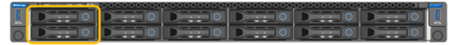

= SG110 and SG1100 appliances: Overview
:icons: font
:imagesdir: ../media/

[.lead]
The StorageGRID SG110 services appliance and the SG1100 services appliance can operate as a Gateway Node and as an Admin Node to provide high availability load balancing services in a StorageGRID system. Both appliances can operate as Gateway Nodes and Admin Nodes (primary or non-primary) at the same time.

== Appliance features

Both models of the services appliance provide the following features:

* Gateway Node or Admin Node functions for a StorageGRID system.
* The StorageGRID Appliance Installer to simplify node deployment and configuration.
* When deployed, can access StorageGRID software from an existing Admin Node or from software downloaded to a local drive. To further simplify the deployment process, a recent version of the software is preloaded onto the appliance during manufacturing.
* A baseboard management controller (BMC) for monitoring and diagnosing some of the appliance hardware.
* The ability to connect to all three StorageGRID networks, including the Grid Network, the Admin Network, and the Client Network:
 ** The SG110 supports up to four 10- or 25-GbE connections to the Grid Network and Client Network.
 ** The SG1100 supports up to four 10-, 25-, 40-, or 100-GbE connections to the Grid Network and Client Network.

== SG110 and SG1100 diagrams

This figure shows the front of the SG110 and the SG1100 with the bezel removed. From the front, the two appliances are identical except for the product name on the bezel.

The two solid-state drives (SSDs), indicated by the orange outline, are used for storing the StorageGRID operating system and are mirrored using RAID 1 for redundancy. When the SG110 or SG1100 services appliance is configured as an Admin Node, these drives might be used to store audit logs, metrics, and database tables.

The remaining drive slots are blank.

== SG110 connectors

This figure shows the back of the SG110, including the ports, fans, and power supplies.

image::../media/sg110_rear_view.png[Rear Connectors SG110]

[cols="1a,2a,2a,2a" options="header"]
|===
|Callout | Port| Type| Use
a|
1
a|
Network ports 1-4
a|
10/25-GbE, based on cable or SFP transceiver type (SFP28 and SFP+ modules are supported), switch speed, and configured link speed
a|
Connect to the Grid Network and the Client Network for StorageGRID.
a|
2
a|
BMC management port
a|
1-GbE (RJ-45)
a|
Connect to the appliance baseboard management controller.
a|
3
a|
Diagnostic and support ports
a|
* VGA
* USB
* Micro-USB console port
* Micro-SD slot module

a|
Reserved for technical support use.
a|
4
a|
Admin Network port 1
a|
1/10-GbE (RJ-45)
a|
Connect the appliance to the Admin Network for StorageGRID.
a|
5
a|
Admin Network port 2
a|
1/10-GbE (RJ-45)
a|
Options:

* Bond with management port 1 for a redundant connection to the Admin Network for StorageGRID.
* Leave disconnected and available for temporary local access (IP 169.254.0.1).
* During installation, use port 2 for IP configuration if DHCP-assigned IP addresses aren't available.

|===

== SG1100 connectors

This figure shows the connectors on the back of the SG1100.

image::../media/sg1100_rear_view.png[Rear Connectors SG1100]

[cols="1a,2a,2a,2a" options="header"]
|===
| Callout | Port| Type| Use

a|
1
a|
Network ports 1-4
a|
10/25/40/100-GbE, based on cable or transceiver type, switch speed, and configured link speed. QSFP56 (limited to 100GbE/port), QSFP28 (100GbE), and QSFP+ (40GbE) are supported natively. Optional SFP+ (10GbE) or SFP28 (25GbE) transceivers can be used with a QSA (sold separately).
a|
Connect to the Grid Network and the Client Network for StorageGRID.
a|
2
a|
BMC management port
a|
1-GbE (RJ-45)
a|
Connect to the appliance baseboard management controller.
a|
3
a|
Diagnostic and support ports
a|
* VGA
* USB
* Micro-USB console port
* Micro-SD slot module

a|
Reserved for technical support use.
a|
4
a|
Admin Network port 1
a|
1/10-GbE (RJ-45)
a|
Connect the appliance to the Admin Network for StorageGRID.
a|
5
a|
Admin Network port 2
a|
1/10-GbE (RJ-45)
a|
Options:

* Bond with management port 1 for a redundant connection to the Admin Network for StorageGRID.
* Leave disconnected and available for temporary local access (IP 169.254.0.1).
* During installation, use port 2 for IP configuration if DHCP-assigned IP addresses aren't available.

|===

== SG110 and SG1100 applications

You can configure the StorageGRID services appliances in various ways to provide gateway services as well as redundancy of some grid administration services.

Appliances can be deployed in the following ways:

* Add to a new or existing grid as a Gateway Node
* Add to a new grid as a primary or non-primary Admin Node, or to an existing grid as a non-primary Admin Node
* Operate as a Gateway Node and Admin Node (primary or non-primary) at the same time

The appliance facilitates the use of high availability (HA) groups and intelligent load balancing for S3 or Swift data path connections.

The following examples describe how you can maximize the capabilities of the appliance:

* Use two SG110 or two SG1100 appliances to provide gateway services by configuring them as Gateway Nodes.
+
IMPORTANT: Mixing services appliances with different levels of performance in the same site, such as an SG100 or SG110 with an SG1000 or SG1100, can cause unpredictable and inconsistent results when using multiple nodes in a high-availability group or when balancing client load across multiple services appliances

* Use two SG110 or two SG1100 appliances to provide redundancy of some grid administration services. Do this by configuring each appliance as Admin Nodes.
* Use two SG110 or two SG1100 appliances to provide highly available load balancing and traffic shaping services accessed through one or more virtual IP addresses. Do this by configuring the appliances as any combination of Admin Nodes or Gateway Nodes and adding both nodes to the same HA group.
+
IMPORTANT: If you use Admin Nodes and Gateway Nodes in the same HA group, Admin Node-only port will not fail over. See the instructions for https://docs.netapp.com/us-en/storagegrid-118/admin/configure-high-availability-group.html[configuring HA groups^].

When used with StorageGRID storage appliances, both the SG110 and the SG1100 services appliances enable deployment of appliance-only grids with no dependencies on external hypervisors or compute hardware.
