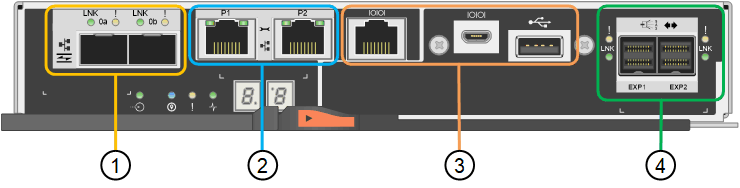

= SG5700 appliances: Overview
:icons: font
:imagesdir: ../media/

[.lead]
The SG5700 StorageGRID appliance is an integrated storage and computing platform that operates as a Storage Node in a StorageGRID grid. The appliance can be used in a hybrid grid environment that combines appliance Storage Nodes and virtual (software-based) Storage Nodes.

StorageGRID SG5700 series appliance provides the following features:

* Integrate the storage and computing elements for a StorageGRID Storage Node.
* Include the StorageGRID Appliance Installer to simplify Storage Node deployment and configuration.
* Includes E-Series SANtricity System Manager for hardware management and monitoring.
* Support up to four 10-GbE or 25-GbE connections to the StorageGRID Grid Network and Client Network.
* Support Full Disk Encryption (FDE) drives or FIPS drives. When these drives are used with the Drive Security feature in SANtricity System Manager, unauthorized access to data is prevented.

The SG5700 appliance is available in four models: the SG5712 and SG5712X, and the SG5760 and SG5760X. There are no specification or functional differences between the SG5712 and SG5712X except for the location of the interconnect ports on the storage controller. Similarly, there are no specification or functional differences between the SG5760 and SG5760X except for the location of the interconnect ports on the storage controller.  

== SG5700 components

The SG5700 models include the following components:

[role="tabbed-block"]
====

.SG5712
--
Compute controller::
E5700SG controller

Storage controller::
E2800A controller

Chassis::
E-Series DE212C enclosure, a two rack-unit (2U) enclosure

Drives::
12 NL-SAS drives (3.5-inch)

Redundant power supplies and fans::
Two power-fan canisters
--

.SG5712X
--
Compute controller::
E5700SG controller

Storage controller::
E2800B controller

Chassis::
E-Series DE212C enclosure, a two rack-unit (2U) enclosure

Drives::
12 NL-SAS drives (3.5-inch)

Redundant power supplies and fans::
Two power-fan canisters
--

.SG5760
--
Compute controller::
E5700SG controller

Storage controller::
E2800A controller

Chassis::
E-Series DE460C enclosure, a four rack-unit (4U) enclosure

Drives::
60 NL-SAS drives (3.5-inch)

Redundant power supplies and fans::
Two power canisters and two fan canisters
--

.SG5760X
--
Compute controller::
E5700SG controller

Storage controller::
E2800B controller

Chassis::
E-Series DE460C enclosure, a four rack-unit (4U) enclosure

Drives::
60 NL-SAS drives (3.5-inch)

Redundant power supplies and fans::
Two power canisters and two fan canisters
--
====

The maximum raw storage available in the StorageGRID appliance is fixed, based on the number of drives in each enclosure. You can't expand the available storage by adding a shelf with additional drives.

== SG5700 diagrams

=== SG5712 front and rear views

The figures show the front and back of the SG5712, a 2U enclosure that holds 12 drives.

image::../media/sg5712_front_and_back_views.gif["The front and back of the SG5712 appliance"] 

=== SG5712 components

The SG5712 includes two controllers and two power-fan canisters.

image::../media/sg5712_with_callouts.gif["Controllers and power-fan canisters in the SG5712 appliance"] 

[cols="1a,3a" options="header"]
|===
| Callout| Description
a|
1
a|
E2800A controller (storage controller)
a|
2
a|
E5700SG controller (compute controller)
a|
3
a|
Power-fan canisters
|===

=== SG5712X front and rear views
The figures show the front and back of the SG5712X, a 2U enclosure that holds 12 drives.

image::../media/sg5712x_front_and_back_views.gif["The front and back of the SG5712X appliance"] 

=== SG5712X components

The SG5712X includes two controllers and two power-fan canisters.

image::../media/sg5712x_with_callouts.gif["Controllers and power-fan canisters in the SG5712X appliance"] 

[cols="1a,3a" options="header"]
|===
| Callout| Description
a|
1
a|
E2800B controller (storage controller)
a|
2
a|
E5700SG controller (compute controller)
a|
3
a|
Power-fan canisters
|===

=== SG5760 front and rear views
The figures show the front and back of the SG5760 model, a 4U enclosure that holds 60 drives in 5 drive drawers.

image::../media/sg5760_front_and_back_views.gif["Front and back of the SG5760 appliance"] 

=== SG5760 components

The SG5760 includes two controllers, two fan canisters, and two power canisters.

image::../media/sg5760_with_callouts.gif["Controllers, fan canisters, and power canisters in SG5760 appliance"] 

[cols="1a,2a" options="header"]
|===
| Callout| Description
a|
1
a|
E2800A controller (storage controller)
a|
2
a|
E5700SG controller (compute controller)
a|
3
a|
Fan canister (1 of 2)
a|
4
a|
Power canister (1 of 2)
|===

=== SG5760X front and rear views

The figures show the front and back of the SG5760X model, a 4U enclosure that holds 60 drives in 5 drive drawers.

image::../media/sg5760x_front_and_back_views.gif["Front and back of the SG5760X appliance"] 

=== SG5760X components

The SG5760X includes two controllers, two fan canisters, and two power canisters.

image::../media/sg5760x_with_callouts.gif["Controllers, fan canisters, and power canisters in SG5760X appliance"] 

[cols="1a,3a" options="header"]
|===
| Callout| Description
a|
1
a|
E2800B controller (storage controller)
a|
2
a|
E5700SG controller (compute controller)
a|
3
a|
Fan canister (1 of 2)
a|
4
a|
Power canister (1 of 2)
|===

== SG5700 controllers

Both the 12-drive SG5712 and SG5712X and the 60-drive SG5760 and SG5760X models of the StorageGRID appliance include an E5700SG compute controller and an E-Series E2800 storage controller. 

* The SG5712 and SG5760 use a E2800A controller. 
* The SG5712X and the SG5760X use a E2800B controller.

The E2800A and E2800B controllers are identical in specification and function except for the location of the interconnect ports. 

=== E5700SG compute controller

* Operates as the compute server for the appliance.
* Includes the StorageGRID Appliance Installer.
+
NOTE: StorageGRID software is not preinstalled on the appliance. This software is accessed from the Admin Node when you deploy the appliance.

* Can connect to all three StorageGRID networks, including the Grid Network, the Admin Network, and the Client Network.
* Connects to the E2800 controller and operates as the initiator.

==== E5700SG connectors

image::../media/e5700sg_controller_with_callouts.gif["Connectors on E5700SG controller"] 

[cols="1a,2a,2a,2a" options="header"]
|===
|Callout | Port| Type| Use

| 1
| Interconnect ports 1 and 2
| 16Gb/s Fibre Channel (FC), optical SFP
| Connect the E5700SG controller to the E2800 controller.

| 2
| Diagnostic and support ports
| 
* RJ-45 serial port
* Micro USB serial port
* USB port

| Reserved for technical support.

| 3
| Drive expansion ports
| 12Gb/s SAS
| Not used.

| 4
| Network ports 1-4
| 10-GbE or 25-GbE, based on SFP transceiver type, switch speed, and configured link speed
| Connect to the Grid Network and the Client Network for StorageGRID.

| 5
| Management port 1
| 1-Gb (RJ-45) Ethernet
| Connect to the Admin Network for StorageGRID.

| 6
| Management port 2
| 1-Gb (RJ-45) Ethernet
| Options:

* Bond with management port 1 for a redundant connection to the Admin Network for StorageGRID.
* Leave unwired and available for temporary local access (IP 169.254.0.1).
* During installation, use port 2 for IP configuration if DHCP-assigned IP addresses aren't available.

|===

=== E2800 storage controller

There are two versions of the E2800 storage controller used in the SG5700 appliances: E2800A and E2800B. The E2800A does not have a HIC, and the E2800B has a four-port HIC. The two controller versions have identical specifications and function except for the location of the interconnect ports. 

The E2800 series storage controller has the following specifications: 

* Operates as the storage controller for the appliance.
* Manages the storage of data on the drives.
* Functions as a standard E-Series controller in simplex mode.
* Includes SANtricity OS Software (controller firmware).
* Includes SANtricity System Manager for monitoring appliance hardware and for managing alerts, the AutoSupport feature, and the Drive Security feature.
* Connects to the E5700SG controller and operates as the target.

==== E2800A connectors

 

==== E2800B connectors

image::../media/e2800B_controller_with_callouts.gif["Connectors on E2800B controller"] 

[cols="1a,2a,2a,2a" options="header"]
|===
| Callout | Port| Type| Use

| 1
| Interconnect ports 1 and 2
| 16Gb/s FC optical SFP
| Connect the E2800 controller to the E5700SG controller.

| 2
| Management ports 1 and 2
| 1-Gb (RJ-45) Ethernet
| 
* Port 1 Options:
** Connect to a management network to enable direct TCP/IP access to SANtricity System Manager
** Leave unwired to save a switch port and IP address.  Access SANtricity System Manager using the Grid Manager or Storage Grid Appliance Installer.  

*Note*: some optional SANtricity functionality, such as NTP sync for accurate log timestamps, is not available when you choose to leave Port 1 unwired.

*Note*: StorageGRID 11.5 or greater, and SANtricity 11.70 or greater, are required when you leave Port 1 unwired.

* Port 2 is reserved for technical support use.

| 3
| Diagnostic and support ports
| 
* RJ-45 serial port
* Micro USB serial port
* USB port

| Reserved for technical support use.

| 4
| Drive expansion ports.
| 12Gb/s SAS
| Not used.
|===

.Related information

https://docs.netapp.com/us-en/e-series-family/index.html[NetApp E-Series documentation^]
