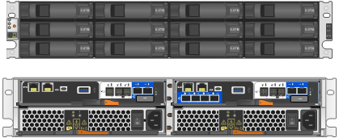

= SG5800 appliances: Overview
:icons: font
:imagesdir: ../media/

[.lead]
The SG5800 StorageGRID appliance is an integrated storage and computing platform that operates as a Storage Node in a StorageGRID grid.

StorageGRID SG5800 series appliance provides the following features:

* Integrate the storage and computing elements for a StorageGRID Storage Node.
* Include the StorageGRID Appliance Installer to simplify Storage Node deployment and configuration.
* Includes E-Series SANtricity System Manager for hardware management and monitoring.
* Support up to four 10-GbE or 25-GbE connections to the StorageGRID Grid Network and Client Network.
* Support Full Disk Encryption (FDE) drives or FIPS drives. When these drives are used with the Drive Security feature in SANtricity System Manager, unauthorized access to data is prevented.

The SG5800 appliance is available in two models: the SG5812 and the SG5860.  

== SG5800 components

The SG5800 models include the following components:

[role="tabbed-block"]
====

.SG5812
--
Compute controller::
SG5800 controller

Storage controller::
E4000 controller

Chassis::
E-Series DE212C enclosure, a two rack-unit (2U) enclosure

Drives::
12 NL-SAS drives (3.5-inch)

Redundant power supplies and fans::
Two power-fan canisters
--

.SG5860
--
Compute controller::
SG5800 controller

Storage controller::
E4000 controller

Chassis::
E-Series DE460C enclosure, a four rack-unit (4U) enclosure

Drives::
60 NL-SAS drives (3.5-inch)

Redundant power supplies and fans::
Two power canisters and two fan canisters
--

====

The maximum raw storage available in the StorageGRID appliance is fixed, based on the number of drives in each enclosure. You can't expand the available storage by adding a shelf with additional drives.

== SG5800 diagrams

=== SG5812 front and rear views

The figures show the front and back of the SG5812, a 2U enclosure that holds 12 drives.

=== SG5812 components

The SG5812 includes two controllers and two power-fan canisters.

image::../media/sg5812_with_callouts.png[Controllers and power-fan canisters in the SG5812 appliance]

[cols="1a,3a" options="header"]
|===
| Callout| Description
a|
1
a|
E4000 controller (storage controller)
a|
2
a|
SG5800 controller (compute controller)
a|
3
a|
Power-fan canisters
|===

=== SG5860 front and rear views
The figures show the front and back of the SG5860 model, a 4U enclosure that holds 60 drives in 5 drive drawers.

image::../media/sg5860_front_and_back_views.png[Front and back of the SG5860 appliance]

=== SG5860 components

The SG5860 includes two controllers, two fan canisters, and two power canisters.

image::../media/sg5860_with_callouts.png[Controllers, fan canisters, and power canisters in SG5860 appliance]

[cols="1a,2a" options="header"]
|===
| Callout| Description
a|
1
a|
E4000 controller (storage controller)
a|
2
a|
SG5800 controller (compute controller)
a|
3
a|
Fan canister (1 of 2)
a|
4
a|
Power canister (1 of 2)
|===

== SG5800 controller

Both the 12-drive SG5812 and the 60-drive SG5860 models of the StorageGRID appliance include an SG5800 compute controller and an E-Series E4000 storage controller. 

=== SG5800 compute controller

* Operates as the compute server for the appliance.
* Includes the StorageGRID Appliance Installer.
+
NOTE: StorageGRID software is not preinstalled on the appliance. This software is accessed from the Admin Node when you deploy the appliance.

* Can connect to all three StorageGRID networks, including the Grid Network, the Admin Network, and the Client Network.
* Connects to the E4000 controller and operates as the initiator.

==== SG5800 connectors

image::../media/sg5800_controller_with_callouts.png[Connectors on SG5800 controller]

[cols="1a,2a,2a,2a" options="header"]
|===
|Callout | Port| Type| Use

| 1
| Management port 1
| 1-Gb (RJ-45) Ethernet
| Connect to the Admin Network for StorageGRID.

| 2
| Diagnostic and support ports
| 
* RJ-45 serial port
* USB-C serial port
* USB port

| Reserved for technical support.

| 3
| Drive expansion ports
| 12Gb/s SAS
| Not used.

| 4
| Interconnect ports 1 and 2
| 25GbE iSCSI
| Connect the SG5800 controller to the E4000 controller.

| 5
| Network ports 1-4
| 10-GbE or 25-GbE, based on SFP transceiver type, switch speed, and configured link speed
| Connect to the Grid Network and the Client Network for StorageGRID.

|===

=== E4000 storage controller

The E4000 series storage controller has the following specifications: 

* Operates as the storage controller for the appliance.
* Manages the storage of data on the drives.
* Functions as a standard E-Series controller in simplex mode.
* Includes SANtricity OS Software (controller firmware).
* Includes SANtricity System Manager for monitoring appliance hardware and for managing alerts, the AutoSupport feature, and the Drive Security feature.
* Connects to the SG5800 controller and operates as the target.

==== E4000 connectors

image::../media/e4000_controller_with_callouts.png[Connectors on E4000 controller]

[cols="1a,2a,2a,2a" options="header"]
|===
| Callout | Port| Type| Use

| 1
| Management port
| 1-Gb (RJ-45) Ethernet
| 
Port Options:
** Connect to a management network to enable direct TCP/IP access to SANtricity System Manager
** Leave unwired to save a switch port and IP address.  Access SANtricity System Manager using the Grid Manager or Storage Grid Appliance Installer.  

*Note*: Some optional SANtricity functionality, such as NTP sync for accurate log timestamps, is not available when you choose to leave the management port unwired.

*Note*: StorageGRID 11.8 or greater, and SANtricity 11.8 or greater, are required when you leave the management unwired.

| 2
| Diagnostic and support ports
| 
* RJ-45 serial port
* USB-C serial port
* USB port

| Reserved for technical support use.

| 3
| Drive expansion ports.
| 12Gb/s SAS
| Not used.

| 4
| Interconnect ports 1 and 2
| 25GbE iSCSI
| Connect the E4000 controller to the SG5800 controller.

|===

.Related information

http://mysupport.netapp.com/info/web/ECMP1658252.html[NetApp E-Series Systems Documentation Site^]
