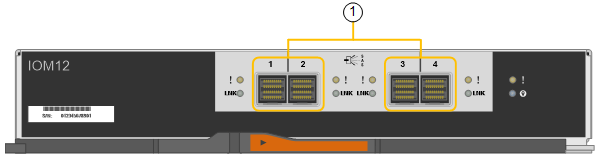

= SG6060 and SG6060X appliances: Overview
:icons: font
:imagesdir: ../media/

[.lead]
The StorageGRID SG6060 and SG6060X appliances each include a compute controller and a storage controller shelf that contains two storage controllers and 60 drives. 

Optionally, 60-drive expansion shelves can be added to both appliances. There are no specification or functional differences between the SG6060 and SG6060X except for the location of the interconnect ports on the storage controller.

== SG6060 and SG6060X components

The SG6060 and SG6060X appliances include the following components:

Compute controller::
The SG6000-CN controller is a one-rack unit (1U) server that includes:
+
* 40 cores (80 threads)
* 192 GB RAM
* Up to 4 × 25 Gbps aggregate Ethernet bandwidth
* 4 × 16 Gbps Fibre Channel (FC) interconnect
* Baseboard management controller (BMC) that simplifies hardware management
* Redundant power supplies

Storage controller shelf::
The E-Series E2860 controller shelf (storage array) is a 4U shelf that includes:
+
* Two E2800 series controllers (duplex configuration) to provide storage controller failover support
** The SG6060 contains E2800A storage controllers
** The SG6060X contains E2800B storage controllers
* Five-drawer drive shelf that holds sixty 3.5-inch drives (2 solid-state drives, or SSDs, and 58 NL-SAS drives)
* Redundant power supplies and fans

Optional: Storage expansion shelves::
Each SG6060 and SG6060X appliance can have one or two expansion shelves for a total of 180 drives (two of these drives are reserved for E-Series read cache).
+
*Note:* Expansion shelves can be installed during initial deployment or added later.
+
The E-Series DE460C enclosure is a 4U shelf that includes:
+
* Two input/output modules (IOMs)
* Five drawers, each holding 12 NL-SAS drives, for a total of 60 drives
* Redundant power supplies and fans

== SG6060 and SG6060X diagrams
The fronts of the SG6060 and SG6060X are identical.

=== SG6060 or SG6060X front view
This figure shows the front of the SG6060 or SG6060X, which includes a 1U compute controller and a 4U shelf containing two storage controllers and 60 drives in five drive drawers.

image::../media/sg6060_front_view_with_and_without_bezels.gif[SG6060 Front View]

[cols="1a,2a" options="header"]
|===
| Callout| Description
a|
1
a|
SG6000-CN compute controller with front bezel
a|
2
a|
E2860 controller shelf with front bezel (optional expansion shelf appears identical)
a|
3
a|
SG6000-CN compute controller with front bezel removed
a|
4
a|
E2860 controller shelf with front bezel removed (optional expansion shelf appears identical)
|===

=== SG6060 rear view
This figure shows the back of the SG6060, including the compute and storage controllers, fans, and power supplies.

image::../media/sg6060_rear_view.gif[SG6060 Rear View]

[cols="1a,2a" options="header"]
|===
| Callout| Description
a|
1
a|
Power supply (1 of 2) for SG6000-CN compute controller
a|
2
a|
Connectors for SG6000-CN compute controller
a|
3
a|
Fan (1 of 2) for E2860 controller shelf
a|
4
a|
E-Series E2800A storage controller (1 of 2) and connectors
a|
5
a|
Power supply (1 of 2) for E2860 controller shelf
|===

=== SG6060X rear view
This figure shows the back of the SG6060X.

image::../media/sg6060x_rear_view.gif[SG6060x Rear View]

[cols="1a,2a" options="header"]
|===
| Callout| Description
a|
1
a|
Power supply (1 of 2) for SG6000-CN compute controller
a|
2
a|
Connectors for SG6000-CN compute controller
a|
3
a|
Fan (1 of 2) for E2860 controller shelf
a|
4
a|
E-Series E2800B storage controller (1 of 2) and connectors
a|
5
a|
Power supply (1 of 2) for E2860 controller shelf
|===

=== Expansion shelf

This figure shows the back of the optional expansion shelf for the SG6060 and SG6060X, including the input/output modules (IOMs), fans, and power supplies. Each SG6060 can be installed with one or two expansion shelves, which can be included in the initial installation or added later.

image::../media/de460c_expansion_shelf_rear_view.gif[Expansion Shelf Rear]

[cols="1a,2a" options="header"]
|===
| Callout| Description
a|
1
a|
Fan (1 of 2) for expansion shelf
a|
2
a|
IOM (1 of 2) for expansion shelf
a|
3
a|
Power supply (1 of 2) for expansion shelf
|===

== SG6000 controllers

Each model of the StorageGRID SG6000 appliance includes an SG6000-CN compute controller in a 1U enclosure and duplex E-Series storage controllers in a 2U or 4U enclosure, depending on the model. Review the diagrams to learn more about each type of controller.

=== SG6000-CN compute controller

* Provides compute resources for the appliance.
* Includes the StorageGRID Appliance Installer.
+
NOTE: StorageGRID software is not preinstalled on the appliance. This software is retrieved from the Admin Node when you deploy the appliance.

* Can connect to all three StorageGRID networks, including the Grid Network, the Admin Network, and the Client Network.
* Connects to the E-Series storage controllers and operates as the initiator.

==== SG6000-CN connectors

image::../media/sg6000_cn_rear_connectors.gif[SG6000-CN Rear Connectors]

[cols="1a,2a,2a,3a" options="header"]
|===
| Callout | Port| Type| Use

| 1
| Interconnect ports 1-4
| 16-Gb/s Fibre Channel (FC), with integrated optics
| Connect the SG6000-CN controller to the E2800 controllers (two connections to each E2800).

| 2
| Network ports 1-4
| 10-GbE or 25-GbE, based on cable or SFP transceiver type, switch speed, and configured link speed
| Connect to the Grid Network and the Client Network for StorageGRID.

| 3
| BMC management port
| 1-GbE (RJ-45)
| Connect to the SG6000-CN baseboard management controller.

| 4
| Diagnostic and support ports
| 
* VGA
* Serial, 115200 8-N-1
* USB

| Reserved for technical support use.

| 5
| Admin Network port 1
| 1-GbE (RJ-45)
| Connect the SG6000-CN to the Admin Network for StorageGRID.

| 6
| Admin Network port 2
| 1-GbE (RJ-45)
| Options:

* Bond with management port 1 for a redundant connection to the Admin Network for StorageGRID.
* Leave unwired and available for temporary local access (IP 169.254.0.1).
* During installation, use port 2 for IP configuration if DHCP-assigned IP addresses aren't available.

|===

=== SGF6024: EF570 storage controllers

* Two controllers for failover support.
* Manage the storage of data on the drives.
* Function as standard E-Series controllers in a duplex configuration.
* Include SANtricity OS Software (controller firmware).
* Include SANtricity System Manager for monitoring storage hardware and for managing alerts, the AutoSupport feature, and the Drive Security feature.
* Connect to the SG6000-CN controller and provide access to the flash storage.

==== EF570 connectors

image::../media/ef570_rear_connectors.gif[EF570 Rear Connectors]

[cols="1a,2a,2a,3a" options="header"]
|===
|Callout | Port| Type| Use

| 1
| Interconnect ports 1 and 2
| 16-Gb/s FC optical SFP
| Connect each of the EF570 controllers to the SG6000-CN controller.

There are four connections to the SG6000-CN controller (two from each EF570).

| 2
| Diagnostic and support ports
| 
* RJ-45 serial port
* Micro USB serial port
* USB port

| Reserved for technical support use.

| 3
| Drive expansion ports
| 12Gb/s SAS
| Not used. The SGF6024 appliance does not support expansion drive shelves.

| 4
| Management ports 1 and 2
| 1-Gb (RJ-45) Ethernet
| 
* Port 1 connects to the network where you access SANtricity System Manager on a browser.
* Port 2 is reserved for technical support use.

|===

=== SG6060 and SG6060X: E2800 storage controllers
* Two controllers for failover support.
* Manage the storage of data on the drives.
* Function as standard E-Series controllers in a duplex configuration.
* Include SANtricity OS Software (controller firmware).
* Include SANtricity System Manager for monitoring storage hardware and for managing alerts, the AutoSupport feature, and the Drive Security feature. 
* Connect to the SG6000-CN controller and provide access to the storage.

The SG6060 and SG6060X use E2800 storage controllers. 

[cols="1a,2a,2a" options="header"]
|===
| Appliance
| Controller
| Controller HIC

| SG6060
| Two E2800A storage controllers
| None

| SG6060X
| Two E2800B storage controllers
| Four-port HIC

|===

The E2800A and the E2800B storage controllers are identical in specifications and function except for the location of the interconnect ports. 

CAUTION: Don't use an E2800A and an E2800B in the same appliance.

==== E2800A connectors

image::../media/e2800_controller_with_callouts.gif[Connectors on E2800A controller]

[cols="1a,2a,2a,3a" options="header"]
|===
| Callout | Port| Type| Use

| 1
| Interconnect ports 1 and 2
| 16-Gb/s FC optical SFP
| Connect each of the E2800A controllers to the SG6000-CN controller.

There are four connections to the SG6000-CN controller (two from each E2800A).

| 2
| Management ports 1 and 2
| 1-Gb (RJ-45) Ethernet
| 
* Port 1 Options:
** Connect to a management network to enable direct TCP/IP access to SANtricity System Manager
** Leave unwired to save a switch port and IP address.  Access SANtricity System Manager using the Grid Manager or Storage Grid Appliance Installer UIs.  

*Note*: some optional SANtricity functionality, such as NTP sync for accurate log timestamps, is not available when you choose to leave Port 1 unwired.

*Note*: StorageGRID 11.5 or greater, and SANtricity 11.70 or greater, are required when you leave Port 1 unwired.

* Port 2 is reserved for technical support use.

| 3
| Diagnostic and support ports
| 
* RJ-45 serial port
* Micro USB serial port
* USB port

| Reserved for technical support use.

| 4
| Drive expansion ports 1 and 2
| 12Gb/s SAS
| Connect the ports to the drive expansion ports on the IOMs in the expansion shelf.
|===

==== E2800B connectors

image::../media/e2800B_controller_with_callouts.gif[Connectors on E2800B controller]

[cols="1a,2a,2a,3a" options="header"]
|===
|Callout | Port| Type| Use

| 1
| Interconnect ports 1 and 2
| 16-Gb/s FC optical SFP
| Connect each of the E2800B controllers to the SG6000-CN controller.

There are four connections to the SG6000-CN controller (two from each E2800B).

| 2
| Management ports 1 and 2
| 1-Gb (RJ-45) Ethernet
| 
* Port 1 Options:
** Connect to a management network to enable direct TCP/IP access to SANtricity System Manager
** Leave unwired to save a switch port and IP address.  Access SANtricity System Manager using the Grid Manager or Storage Grid Appliance Installer UIs.  

*Note*: some optional SANtricity functionality, such as NTP sync for accurate log timestamps, is not available when you choose to leave Port 1 unwired.

*Note*: StorageGRID 11.5 or greater, and SANtricity 11.70 or greater, are required when you leave Port 1 unwired.

* Port 2 is reserved for technical support use.

| 3
| Diagnostic and support ports
| 
* RJ-45 serial port
* Micro USB serial port
* USB port

| Reserved for technical support use.

| 4
| Drive expansion ports 1 and 2
| 12Gb/s SAS
| Connect the ports to the drive expansion ports on the IOMs in the expansion shelf.
|===

=== SG6060 and SG6060X: IOMs for optional expansion shelves

The expansion shelf contains two input/output modules (IOMs) that connect to the storage controllers or to other expansion shelves.

==== IOM connectors

[cols="1a,2a,2a,3a" options="header"]
|===
|Callout | Port| Type| Use

| 1
| Drive expansion ports 1-4
| 12Gb/s SAS
| Connect each port to the storage controllers or additional expansion shelf (if any).
|===
