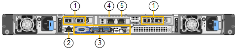
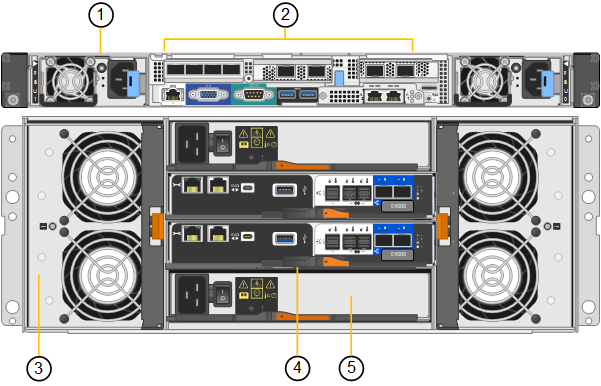
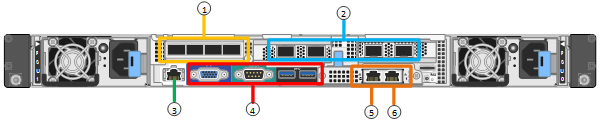
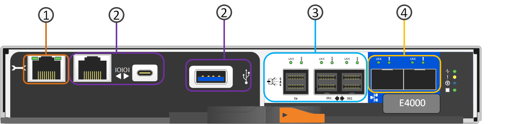

= SG6100 appliances: Overview
:icons: font
:imagesdir: ../media/

[.lead]
The StorageGRID SG6100 series appliances operate as Storage Nodes in a StorageGRID system.  Like all StorageGRID appliances, they can be freely intermixed with other appliance models and software-only nodes in a single deployment. 

The StorageGRID SG6160 appliance includes a compute controller with a pair of NVMe SSDs functioning as a read cache, and a storage controller shelf that contains two storage controllers and 60 NL-SAS hard drives. It can be expanded to up to 180 NL-SAS hard drives through the addition of up to two optional expansion shelves. The StorageGRID SGF6112 appliance is an all-flash appliance with a compact 1U form factor populated with 12 NVMe SSDs.

The SGF6112 and SG6160 appliances provide the following features:

* Integrates the storage and computing elements for a StorageGRID Storage Node.
* Includes the StorageGRID Appliance Installer to simplify Storage Node deployment and configuration.
* Includes a baseboard management controller (BMC) for monitoring and diagnosing the hardware in the compute controller.

The SGF6112 provides the following data protection features: 

* Ability to function after the failure of a single SSD with no impact on object availability.
* Ability to function after multiple SSD failures with a minimum necessary reduction in object availability (based on the design of the underlying RAID scheme).
+
NOTE: Depending on your configured ILM policy, requests for locally unavailable objects can be serviced by other nodes, so there will usually be no reduction in availability.
* Fully recoverable, while in service, from SSD failures that don't result in extreme damage to the RAID housing the node's root volume (the StorageGRID operating system).
* Object data can be restored automatically from copies or erasure coded chunks on other nodes if multiple SSD failures result in local data loss.

The SG6160 provides the following data protection features:

* Ability to function after the failure of any two hard drives (HDDs) with no impact on object availability.
* Rapid evacuation and rebuild of HDDs during failure and replacement events (when configured for DDP or DDP16 during installation), improving data durability relative to standard RAID6.
* Fully recoverable, while in service, from the failure of any two HDDs.
* Object data can be restored automatically from copies or erasure coded chunks on other nodes if multiple HDD failures result in local data loss.

== SG6100 hardware components

=== SGF6112 appliance
The SGF6112 appliance includes the following components:

Compute and storage platform::
A one-rack unit (1U) server that includes:
+
* Two 2.1/2.6 GHz 165 W processors providing 48 cores (96 threads)
* 256 GB RAM
* 2 × 1/10 GBase-T ports
* 4 × 10/25 GbE Ethernet ports for Grid/Client network traffic
* 1 × 256 GB Internal Boot drive (includes StorageGRID software) 
* Baseboard management controller (BMC) that simplifies hardware management
* Redundant power supplies and fans

=== SG6160 appliance

The SG6160 appliance includes the following components:

Compute controller::
The SG6100-CN controller is a one-rack unit (1U) server that includes:
+
* 48 cores (96 threads)
* 256 GB RAM
* Up to 4 × 25 GbE aggregate Ethernet bandwidth (or up 4 x 100 GbE with optional 100G NIC SKU)
* 1 x 100 GbE interconnect
* Two NVMe SSDs for read cache
* Baseboard management controller (BMC) that simplifies hardware management
* Redundant power supplies and fans

Storage controller shelf::
The E-Series E4000 controller shelf (storage array) is a 4U shelf that includes:
+
* Two E4000 series controllers (duplex configuration) to provide storage controller failover support
* Five-drawer drive shelf that holds sixty 3.5-inch, NL-SAS drives 
* Redundant power supplies and fans

Optional: Storage expansion shelves::
Each SG6160 appliance can have one or two expansion shelves for a total of 180 drives.
+
NOTE: Expansion shelves can be installed during initial deployment or added later.
+
The E-Series DE460C enclosure is a 4U shelf that includes:
+
* Two input/output modules (IOMs)
* Five drawers, each holding 12 NL-SAS drives, for a total of 60 drives
* Redundant power supplies and fans

== SGF6112 and SG6160 diagrams

=== SGF6112 front view

This figure shows the front of the SGF6112 without the bezel. The appliance includes a 1U compute and storage platform that contains 12 SSD drives. 

image::../media/sgf6112_front_with_ssds.png[SGF6112 Front View]

=== SGF6112 rear view

This figure shows the back of the SGF6112, including the ports, fans, and power supplies.

[cols="1a,2a,2a,2a" options="header"]
|===
| Callout| Port| Type| Use

| 1
| Network ports 1-4
| 10/25-GbE, based on cable or SFP transceiver type (SFP28 and SFP+ modules are supported), switch speed, and configured link speed.  
| Connect to the Grid Network and the Client Network for StorageGRID.

| 2
| BMC management port
| 1-GbE (RJ-45)
| Connect to the appliance baseboard management controller.

| 3
| Diagnostic and support ports
| 
* VGA
* USB
* Micro-USB console port
* Micro-SD slot module

| Reserved for technical support use.

| 4
| Admin Network port 1
| 1/10-GbE (RJ-45)
| Connect the appliance to the Admin Network for StorageGRID.

| 5
| Admin Network port 2
| 1/10-GbE (RJ-45)
|  Options:

* Bond with Admin Network port 1 for a redundant connection to the Admin Network for StorageGRID.
* Leave disconnected and available for temporary local access (IP 169.254.0.1).
* During installation, use port 2 for IP configuration if DHCP-assigned IP addresses aren't available.
|===

=== SG6160 front view

This figure shows the front of the SG6160, which includes a 1U compute controller and a 4U shelf containing two storage controllers and 60 drives in five drive drawers.

image::../media/sg6160_front_view_without_bezels.png[SG6160 Front View]

[cols="1a,2a" options="header"]
|===
| Callout| Description
a|
1
a|
SG6100-CN compute controller with front bezel removed
a|
2
a|
E4000 controller shelf with front bezel removed (optional expansion shelf appears identical) 
|===

=== SG6160 rear view

This figure shows the back of the SG6160, including the compute and storage controllers, fans, and power supplies.

[cols="1a,2a" options="header"]
|===
| Callout| Description
a|
1
a|
Power supply (1 of 2) for SG6100-CN compute controller
a|
2
a|
Connectors for SG6100-CN compute controller
a|
3
a|
Fan (1 of 2) for E4000 controller shelf
a|
4
a|
E-Series E400 storage controller (1 of 2) and connectors
a|
5
a|
Power supply (1 of 2) for E4000 controller shelf
|===

== SG6100 controllers

=== SG6100-CN compute controller
* Provides compute resources for the appliance.
* Includes the StorageGRID Appliance Installer.
+
NOTE: StorageGRID software is not preinstalled on the appliance. This software is retrieved from the Admin Node when you deploy the appliance.

* Can connect to all three StorageGRID networks, including the Grid Network, the Admin Network, and the Client Network.
* Connects to the E-Series storage controllers and operates as the initiator.

[cols="1a,2a,2a,3a" options="header"]
|===
| Callout | Port| Type| Use

| 1
| Network ports 1-4
| * 10/25/100-GbE based on cable or SFP transceiver type, switch speed, and configured link speed
* With optional 100G NIC SKU (SG6160 only), 10/25/40/100-GbE based on cable or transceiver type, switch speed, and configured link speed. QSFP56 (limited to 100GbE/port), QSFP28 (100GbE), and QSFP+ (40GbE) are supported natively. Optional SFP+ (10GbE) or SFP28 (25GbE) transceivers can be used with a QSA (sold separately).
| Connect to the Grid Network and the Client Network for StorageGRID.

| 2
| BMC management port
| 1-GbE (RJ-45)
| Connect to the SG6100-CN baseboard management controller.

| 3
| Diagnostic and support ports
| 
* VGA
* USB
* Micro-USB console port
* Micro-SD slot module

| Reserved for technical support use.

| 4
| Admin Network port 1
| 1/10-GbE (RJ-45)
| Connect the SG6100-CN to the Admin Network for StorageGRID.

| 5
| Admin Network port 2
| 1/10-GbE (RJ-45)
| Options:

* Bond with management port 1 for a redundant connection to the Admin Network for StorageGRID.
* Leave unwired and available for temporary local access (IP 169.254.0.1).
* During installation, use port 2 for IP configuration if DHCP-assigned IP addresses aren't available.

| 6
| Interconnect port
| 100-GbE
| Connect the SG6100-CN controller to the E4000 controllers. 

|===

=== SG6160: E4000 storage controller

* Two controllers for failover support.
* Manage the storage of data on the drives.
* Function as standard E-Series controllers in a duplex configuration.
* Include SANtricity OS Software (controller firmware).
* Include SANtricity System Manager for monitoring storage hardware and for managing alerts, the AutoSupport feature, and the Drive Security feature. 
* Connect to the SG6100-CN controller and provide access to the storage.

[cols="1a,2a,2a,3a" options="header"]
|===
| Callout | Port| Type| Use

| 1
| Management port 1
| 1-Gb (RJ-45) Ethernet
| 
* Port 1 Options:
** Connect to a management network to enable direct TCP/IP access to SANtricity System Manager
** Leave unwired to save a switch port and IP address.  Access SANtricity System Manager using the Grid Manager or Storage Grid Appliance Installer.  

*Note*: Some optional SANtricity functionality, such as NTP sync for accurate log timestamps, is not available when you choose to leave Port 1 unwired.

| 2
| Diagnostic and support ports
| 
* RJ-45 serial port
* Micro USB serial port
* USB port

| Reserved for technical support use.

| 3
| Drive expansion ports 1 and 2
| 12Gb/s SAS
| Connect the ports to the drive expansion ports on the IOMs in the expansion shelf.

| 4
| Interconnect ports 1 and 2
| 25GbE iSCSI
| Connect each of the E4000 controllers to the SG6100-CN controller.

There are four connections to the SG6100-CN controller (two from each E4000).

|===

=== SG6160: IOMs for optional expansion shelves

The expansion shelf contains two input/output modules (IOMs) that connect to the storage controllers or to other expansion shelves.

==== IOM connectors

image::../media/iom_connectors.gif[IOM Rear]

[cols="1a,2a,2a,3a" options="header"]
|===
|Callout | Port| Type| Use

| 1
| Drive expansion ports 1-4
| 12Gb/s SAS
| Connect each port to the storage controllers or additional expansion shelf (if any).
|===

// 2024 JUL 17, SGRIDDOC-75