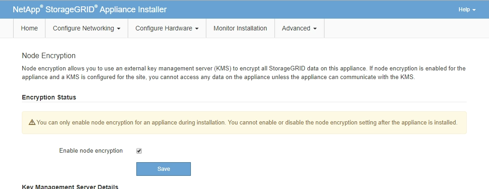

= Optional: Enable node or drive encryption
:icons: font
:imagesdir: ../media/

[.lead]
You can enable encryption at the node and disk levels to protect the disks in your appliance against physical loss or removal from the site.

* <<Enable node encryption,Node encryption>> uses software encryption to protect all disks in the appliance. It does not require special drive hardware. The encryption is performed by appliance software using keys managed by an external key management server (KMS).
* <<Enable drive encryption,Drive encryption>> uses hardware encryption to protect self-encrypting drives (SEDs), also known as full-disk encryption (FED) drives, including those drives that meet the Federal Information Processing Standards (FIPS). Drive encryption is performed within each drive using encryption keys managed by a StorageGRID key manager.

You can perform both encryption levels on supported drives for additional security.

See https://review.docs.netapp.com/us-en/storagegrid-118_main/admin/reviewing-storagegrid-encryption-methods.html[StorageGRID encryption methods^] for information about all encryption methods available for StorageGRID appliances.

== Enable node encryption

If you enable node encryption, the disks in your appliance can be protected by secure key management server (KMS) encryption against physical loss or removal from the site. You must select and enable node encryption during appliance installation. You can't disable node encryption after the KMS encryption process starts.

If you are using ConfigBuilder to generate a JSON file, you can enable node encryption automatically. See link:automating-appliance-installation-and-configuration.html[Automate appliance installation and configuration].

.Before you begin

Review the information about https://review.docs.netapp.com/us-en/storagegrid-118_main/admin/kms-configuring.html[configuring KMS^].

.About this task

An appliance that has node encryption enabled connects to the external key management server (KMS) that is configured for the StorageGRID site. Each KMS (or KMS cluster) manages the encryption keys for all appliance nodes at the site. These keys encrypt and decrypt the data on each disk in an appliance that has node encryption enabled.

A KMS can be set up in Grid Manager before or after the appliance is installed in StorageGRID. See the information about KMS and appliance configuration in the instructions for administering StorageGRID for additional details.

* If a KMS is set up before installing the appliance, KMS-controlled encryption begins when you enable node encryption on the appliance and add it to a StorageGRID site where KMS is configured.
* If a KMS is not set up before you install the appliance, KMS-controlled encryption is performed on each appliance that has node encryption enabled as soon as a KMS is configured and available for the site that contains the appliance node.

CAUTION: When an appliance is installed with node encryption enabled, a temporary key is assigned. The data on the appliance is not protected until the appliance is connected to the Key Management System (KMS) and a KMS security key is set. See the https://review.docs.netapp.com/us-en/storagegrid-118_main/admin/kms-overview-of-kms-and-appliance-configuration.html[KMS appliance configuration overview^] for additional information.

Without the KMS key needed to decrypt the disk, data on the appliance can't be retrieved and is effectively lost. This is the case whenever the decryption key can't be retrieved from the KMS. The key becomes inaccessible if a customer clears the KMS configuration, a KMS key expires, connection to the KMS is lost, or the appliance is removed from the StorageGRID system where its KMS keys are installed.

.Steps

. Open a browser, and enter one of the IP addresses for the appliance's compute controller.
+
`*https://_Controller_IP_:8443*`
+
`_Controller_IP_` is the IP address of the compute controller (not the storage controller) on any of the three StorageGRID networks.
+
The StorageGRID Appliance Installer Home page appears.
+
CAUTION: After the appliance has been encrypted with a KMS key, the appliance disks can't be decrypted without using the same KMS key.

. Select *Configure Hardware* > *Node Encryption*.
+

. Select *Enable node encryption*.
+
Before appliance installation, you can clear *Enable node encryption* without risk of data loss. When the installation begins, the appliance node accesses the KMS encryption keys in your StorageGRID system and begins disk encryption. You can't disable node encryption after the appliance is installed.
+
CAUTION: After you add an appliance that has node encryption enabled to a StorageGRID site that has a KMS, you can't stop using KMS encryption for the node.

. Select *Save*.
. Deploy the appliance as a node in your StorageGRID system.
+
KMS-controlled encryption begins when the appliance accesses the KMS keys configured for your StorageGRID site. The installer displays progress messages during the KMS encryption process, which might take a few minutes depending on the number of disk volumes in the appliance.
+
NOTE: Appliances are initially configured with a random non-KMS encryption key assigned to each disk volume. The disks are encrypted using this temporary encryption key, that is not secure, until the appliance that has node encryption enabled accesses the KMS keys configured for your StorageGRID site.

.After you finish

You can view node-encryption status, KMS details, and the certificates in use when the appliance node is in maintenance mode. See link:../commonhardware/monitoring-node-encryption-in-maintenance-mode.html[Monitor node encryption in maintenance mode] for information.

== Drive encryption

Drive encryption is managed on self-encrypting drive (SED) hardware during the write and read processes. Access to data on these drives is controlled by a user-defined passphrase. Drive encryption is used for direct-attached solid-state drives (SSDs) that are used for caching in StorageGRID appliances. 

Encrypted SEDs automatically lock when the appliance is powered down or when the drive is removed from the appliance. An encrypted SED remains locked after power is restored to it until the correct passphrase is entered. To allow drives to be accessed without manually reentering the passphrase, the passphrase is stored on the StorageGRID appliance to unlock encrypted drives that remain in the appliance when the appliance restarts. Drives encrypted with an SED passphrase can be accessed by anyone who knows the passphrase. 

Drive encryption doesn't apply to SANtricity-managed drives. If you have a StorageGRID appliance with SEDs and SANtricity controllers, you can enable drive security in link:../installconfig/accessing-and-configuring-santricity-system-manager.html[SANtricity System Manager].

You can enable drive encryption during initial appliance installation before loading Grid Manager. You can also enable node encryption or change your passphrase by placing the appliance in maintenance mode.

.Before you begin

Review the information about https://review.docs.netapp.com/us-en/storagegrid-118_main/admin/reviewing-storagegrid-encryption-methods.html[StorageGRID encryption methods^].

.About this task

A passphrase is set when drive encryption is initially enabled. If a compute node is replaced or if an encrypted SED is moved to a new compute node, you must manually reenter the passphrase.

CAUTION: Make sure that you store the drive-encryption passphrase in a secure location. Encrypted SEDs can't be accessed without manually entering the same passphrase if the SED is installed in another StorageGRID appliance.

=== Enable drive encryption

. Access the StorageGRID Appliance Installer.
+
* During initial appliance installation, open a browser and enter one of the IP addresses for the appliance's compute controller.
+
`*https://_Controller_IP_:8443*`
+
`_Controller_IP_` is the IP address of the compute controller (not the storage controller) on any of the three StorageGRID networks.

* For an existing StorageGRID appliance, link:../commonhardware/placing-appliance-into-maintenance-mode.html[place the appliance into maintenance mode].

. From the StorageGRID Appliance Installer Home page, select *Configure Hardware* > *Drive Encryption*.

. Select *Enable drive encryption*.
+
CAUTION: After enabling drive encryption and setting the passphrase the SED drives are hardware encrypted. The content of the drive can't be accessed without using the same passphrase.

. Select *Save*.
+ 
After the drive is encrypted, drive passphrase information displays.
+ 
NOTE: When a drive is initially encrypted, the passphrase is set to a default blank value and the current passphrase text indicates "default (not secure)." While the data on this drive is encrypted, it can be accessed without entering a passphrase until a unique passphrase is set.

. Enter a unique passphrase for encrypted drive access and then enter the passphrase again to confirm it. The passphrase must be at least 8 and no more than 32 characters in length.

. Enter passphrase display text that will help you recall the passphrase.
+
Save the passphrase and passphrase display text in a secure location, such as a password management application.

. Select *Save*.

=== View drive-encryption status

. link:../commonhardware/placing-appliance-into-maintenance-mode.html[Place the appliance into maintenance mode].

. From the StorageGRID Appliance Installer, select *Configure Hardware* > *Drive Encryption*.

=== Access an encrypted drive

You must enter the passphrase to access an encrypted drive after compute node replacement or after a drive is moved to a new compute node.

. Access the StorageGRID Appliance Installer.
+
* Open a browser and enter one of the IP addresses for the appliance's compute controller.
+
`*https://_Controller_IP_:8443*`
+
`_Controller_IP_` is the IP address of the compute controller (not the storage controller) on any of the three StorageGRID networks.

* link:../commonhardware/placing-appliance-into-maintenance-mode.html[Place the appliance into maintenance mode].

. From the StorageGRID Appliance Installer, select the *Drive Encryption* link in the warning banner.

. Enter the drive encryption passphrase you set previously in *New passphrase* and *Retype new passphrase*.
+
NOTE: If you enter values for the passphrase and passphrase display text that do not match the values previously entered, drive authentication will fail. You will need to restart the appliance and enter the correct passphrase and passphrase display text. 

. Enter the passphrase display text you set previously in *New passphrase display text*. 

. Select *Save*.
+
The warning banners will no longer display when the drives are unlocked.

. Return to the StorageGRID Appliance Installer Home page and select *Reboot* in the Installation section banner to restart the compute node and access the encrypted drives.

=== Change the drive-encryption passphrase

. Access the StorageGRID Appliance Installer.
+
* Open a browser and enter one of the IP addresses for the appliance's compute controller.
+
`*https://_Controller_IP_:8443*`
+
`_Controller_IP_` is the IP address of the compute controller (not the storage controller) on any of the three StorageGRID networks.

* link:../commonhardware/placing-appliance-into-maintenance-mode.html[Place the appliance into maintenance mode].

. From the StorageGRID Appliance Installer, select *Configure Hardware* > *Drive Encryption*.

. Enter a new unique passphrase for drive access and then enter the passphrase again to confirm it. The passphrase must be at least 8 and no more than 32 characters in length.
+
NOTE: You must have already authenticated with access to the drive before you can change the drive-encryption passphrase.

. Enter passphrase display text that will help you recall the passphrase.

. Select *Save*.
+
CAUTION: After setting a new passphrase the encrypted drives can't be decrypted without using the new passphrase and passphrase display text.

. Save the new passphrase and passphrase display text in a secure location, such as a password management application.

=== Disable drive encryption

. Access the StorageGRID Appliance Installer.
+
* Open a browser and enter one of the IP addresses for the appliance's compute controller.
+
`*https://_Controller_IP_:8443*`
+
`_Controller_IP_` is the IP address of the compute controller (not the storage controller) on any of the three StorageGRID networks.

* link:../commonhardware/placing-appliance-into-maintenance-mode.html[Place the appliance into maintenance mode].

. From the StorageGRID Appliance Installer, select *Configure Hardware* > *Drive Encryption*.

. Clear *Enable drive encryption*.

. To erase all drive data when drive encryption is disabled, select *Erase all data on drives.*
+
NOTE: The data erasure option is only avaliable from the StorageGRID Appliance Installer before the appliance is added to the grid. You cannot access this option when accessing the StorageGRID Appliance Installer from maintenance mode.

. Select *Save*.

The drive contents are unencrypted or cryptographically erased, the encryption passphrase is erased, and the SEDs are now accessible without a passphrase.

// 2023 SEP 8, SGRIDDOC-18
