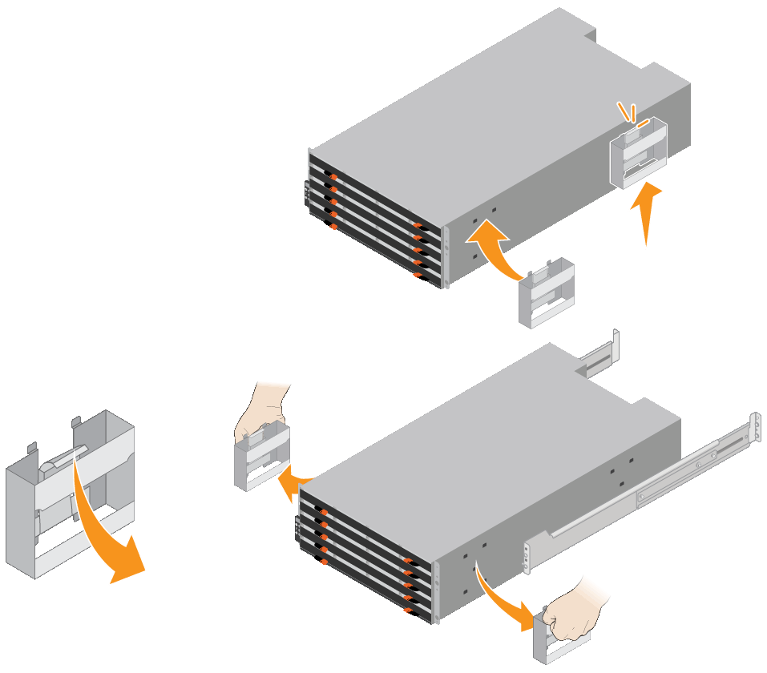

= Install 60-drive shelves (SG6160)
:icons: font
:imagesdir: ../media/

[.lead]
You install a set of rails for the E4000 controller shelf in your cabinet or rack, and then slide the controller shelf onto the rails. If you are installing 60-drive expansion shelves, the same procedure applies.

.Before you begin

* You have reviewed the Safety Notices document included in the box, and understand the precautions for moving and installing hardware.
* You have the instructions packaged with the rail kit.

CAUTION: To avoid damaging the hardware, never move the shelf if drives are installed. You must remove all drives before moving the shelf.

CAUTION: When installing the E4000 controller shelf or optional expansion shelves, install hardware from the bottom to the top of the rack or cabinet to prevent the equipment from tipping over. To ensure that the heaviest equipment is at the bottom of the cabinet or rack, install the SG6100-CN controller above the E4000 controller shelf and expansion shelves.

CAUTION: Before committing to the installation, verify that the 0.5m optic cables shipped with the appliance, or cables that you supply, are long enough for the planned layout.

.Steps

. Carefully follow the instructions for the rail kit to install the rails in your cabinet or rack.
+
For square hole cabinets, first install the provided cage nuts to secure the front and rear of the shelf with screws.

. Remove the outer packing box for the appliance. Then, fold down the flaps on the inner box.
. If you are lifting the appliance by hand, attach the four handles to the sides of the chassis.
+
Push up on each handle until it clicks into place.
+

. Place the back of the shelf (the end with the connectors) on the rails.
. Supporting the shelf from the bottom, slide it into the cabinet. If you are using the handles, use the thumb latches to detach one handle at a time as you slide the shelf in.
+
To remove the handles, pull back on the release latch, push down, then pull away from the shelf.

. Secure the shelf to the front of the cabinet.
+
Insert screws into the first and third holes from the top of the shelf on both sides.

. Secure the shelf to the rear of the cabinet.
+
Place two back brackets on each side of the upper rear section of the shelf. Insert screws into the first and third holes of each bracket.
+
image::../media/mount_hardware.gif[Mount Hardware]

. Repeat these steps for any expansion shelves.
. Install 12 NL-SAS drives in each of of the five drive drawers.

After installing the 60-drive shelf into a cabinet or rack, install all 60 NL-SAS drives into the shelf. Each optional expansion shelf includes 60 NL-SAS drives and no SSD drives. 

. Wrap the strap end of the ESD wristband around your wrist, and secure the clip end to a metal ground to prevent static discharge.
. Release the levers on the top drive drawer, and slide the drawer out using the levers.
. Raise each drive handle to a vertical position.
. Gently position each drive into its slot, and lower the raised drive handle until it clicks into place.
+
image::../media/install_drives_in_e2860.gif[Install Drives]

. Install 12 NL-SAS drives into the top drawer.
. Slide the drawer back in by pushing on the center and closing both levers gently.
+
CAUTION: Stop pushing the drawer if you feel binding. Use the release levers at the front of the drawer to slide the drawer back out. Then, carefully reinsert the drawer into the slot.

. Repeat these steps to install NL-SAS drives into the other four drawers.
+
CAUTION: You must install all 60 drives to ensure correct operation.

. Attach the front bezel to the shelf.
. If you have expansion shelves, repeat these steps to install 12 NL-SAS drives into each drawer of each expansion shelf.
. Proceed to the instructions for installing the SG6100-CN into a cabinet or rack.