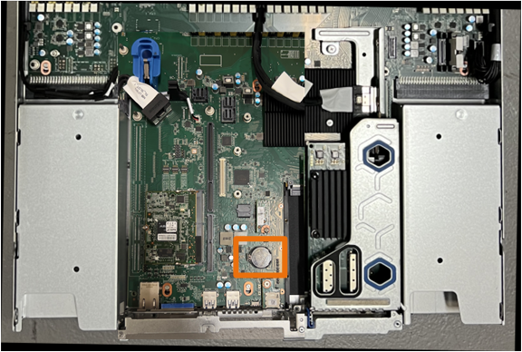
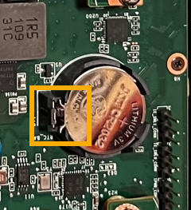

= Replace the CMOS battery in an SG120 or SG1200
:icons: font
:imagesdir: ../media/

[.lead]
Use this procedure to replace the CMOS coin cell battery on the system board.

== Step 1: Remove the CMOS battery

.Before you begin

* You have link:verify-component-to-replace.html[verified the SG120 or SG1200 where the CMOS battery needs to be replaced].
* You have obtained the correct replacement CMOS batteries (CR2032).
* You have link:locating-sg120-and-sg1200-in-data-center.html[physically located the SG120 or SG1200 appliance] where you are replacing the CMOS battery in the data center.
* You have recorded the current BMC configuration of the appliance, if it remains available.
. Log in to the appliance to be replaced:
  .. Enter the following command: `ssh admin@_grid_node_IP_`
  .. Enter the password listed in the `Passwords.txt` file.
  .. Enter the following command to switch to root: `su -`
  .. Enter the password listed in the `Passwords.txt` file.
+
When you are logged in as root, the prompt changes from `$` to `#`.
. Enter: `*run-host-command ipmitool lan print*` to display the current BMC configuration for the appliance.
+
NOTE: A link:power-sg120-and-sg1200-off-on.html#shut-down-the-sg120-or-sg1200-appliance[controlled shutdown of the appliance] is required before removing the appliance from the rack.

* You have disconnected all cables and link:reinstalling-sg120-and-sg1200-cover.html[removed the appliance cover].

.About this task
To prevent service interruptions, confirm that all other Storage Nodes are connected to the grid before starting the CMOS battery replacement or replace the battery during a scheduled maintenance window when periods of service disruption are acceptable. See the information about https://docs.netapp.com/us-en/storagegrid/monitor/monitoring-system-health.html#monitor-node-connection-states[monitoring node connection states^].

.Steps

. Wrap the strap end of the ESD wristband around your wrist, and secure the clip end to a metal ground to prevent static discharge.

. Remove the CMOS battery.
.. Locate the CMOS battery on the system board. 
+
 
.. Use your finger or a plastic pry tool to press the retaining clip (highlighted) away from the battery to spring it from the socket. 
+
 
.. Remove the battery and dispose of it properly. 

. Install the replacement CMOS battery.
.. Remove the replacement CMOS battery from its packaging.
.. Press the replacement battery into the empty socket on the system board with the positive (+) side up until the battery snaps in place.

. Repeat these steps for the second CMOS battery.

. If you have no other maintenance procedures to perform in the appliance, reinstall the appliance cover, return the appliance to the rack, attach cables, and apply power.

. If the appliance you replaced had drive encryption enabled for the SED drives, you must link:../installconfig/optional-enabling-node-encryption.html#access-an-encrypted-drive[enter the drive encryption passphrase] to access the encrypted drives when the replacement appliance starts for the first time.

. If the appliance you replaced used a key management server (KMS) to manage encryption keys for node encryption, additional configuration might be required before the node can join the grid. If the node does not automatically join the grid, make sure that these configuration settings have transferred to the new appliance and manually configure any settings that don't have the expected configuration:
** link:../installconfig/accessing-storagegrid-appliance-installer.html[Configure StorageGRID connections]
** https://docs.netapp.com/us-en/storagegrid/admin/kms-overview-of-kms-and-appliance-configuration.html#set-up-the-appliance[Configure node encryption for the appliance^]

. Log in to the appliance:
  .. Enter the following command: `ssh admin@_grid_node_IP_`
  .. Enter the password listed in the `Passwords.txt` file.
  .. Enter the following command to switch to root: `su -`
  .. Enter the password listed in the `Passwords.txt` file.
. Restore BMC network connectivity for the appliance. There are two options: 
* Use static IP, netmask, and gateway 
* Use DHCP to obtain an IP, netmask, and gateway

.. To restore the BMC configuration to use a static IP, netmask, and gateway, enter the following commands:
+
`*run-host-command ipmitool lan set 1 ipsrc static*`
+
`*run-host-command ipmitool lan set 1 ipaddr _Appliance_IP_*`
+
`*run-host-command ipmitool lan set 1 netmask _Netmask_IP_*`
+
`*run-host-command ipmitool lan set 1 defgw ipaddr _Default_gateway_*`

.. To restore the BMC configuration to use DHCP to obtain an IP, netmask, and gateway, enter the following command: 
+
`*run-host-command ipmitool lan set 1 ipsrc dhcp*`

. After restoring BMC network connectivity, connect to the BMC interface to audit and restore any additional custom BMC configuration you might have applied. For example, you should confirm the settings for SNMP trap destinations and email notifications. See link:../installconfig/configuring-bmc-interface.html[Configure BMC interface].
. Confirm that the appliance node appears in the Grid Manager and that no alerts appear. 

// 2023 DEC 21, SGRIDDOC-30
