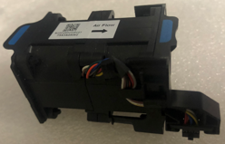

= Replace fan in SG6000-CN compute controller
:icons: font
:imagesdir: ../media/

[.lead]
The SG6000-CN compute controller has eight cooling fans. If one of the fans fails, you must replace it as soon as possible to ensure that the controller has proper cooling.

.Before you begin

* You have unpacked the replacement fan.
* You have link:locating-controller-in-data-center.html[physically located the appliance].
* You have confirmed that the other fans are installed and running.

.About this task

The storage node will not be accessible while you replace the fan.

The photograph shows a fan for the SG6000-CN compute controller. The cooling fans are accessible after you take the top cover off the controller.

NOTE: Each of the two power supply units also contain a fan. Those fans aren't included in this procedure.

 

.Steps

. link:power-sg6000-cn-controller-off-on.html[Shut down the SG6000-CN controller].
. Lift the latch on the top cover and remove the cover from the appliance.
. Locate the fan that failed.
+
image::../media/fan_location.png["Fans Location"] 

. Lift the failed fan out of the chassis.
+
image::../media/fan_removal.png["Fan Removal"] 

. Slide the replacement fan into the open slot in the chassis.
+
Line up the edge of the fan with the guide pin. The pin is circled in the photograph.
+
image::../media/fan_guide_pin.png["Fan Guide Pin"] 

. Press the fan's connector firmly into the circuit board.
+
image::../media/fan_connector_check.png["Fan Connector Check"] 

. Put the top cover back on the appliance, and press the latch down to secure the cover in place.
. link:power-sg6000-cn-controller-off-on.html#poweron[Power on the SG6000-CN controller].
. Confirm that the appliance node appears in the Grid Manager and that no alerts appear.

include::../_include/fru-statement.adoc[]

