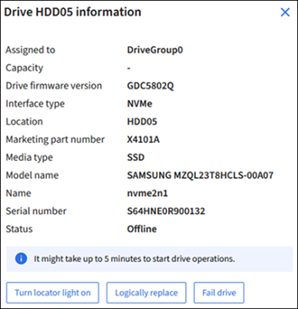

= Use the Manage drives tab (SG110, SG1100, SGF6112, and SG6160)
:icons: font
:imagesdir: ../media/

[.lead]
You can use the Manage drives tab in the Grid Manager to perform troubleshooting and maintenance tasks on the drives for appliances that support this feature.

.Before you begin

* You are signed in to the Grid Manager using a https://review.docs.netapp.com/us-en/storagegrid-119_main/admin/web-browser-requirements.html[supported web browser^].

.About this task

If you have an appliance that supports this feature and either the https://review.docs.netapp.com/us-en/storagegrid-119_main/admin/admin-group-permissions.html[Storage appliance administrator or Root access permission^], a Manage drives tab appears on the appliance details page.

NOTE: For StorageGRID 11.8, The Manage drives tab is only supported for the SGF6112 appliance.

The Manage drives tab contains the following views:

Layout:: Layout of data storage drives in the appliance. Select a drive to view drive details.
+
image:../media/manage_drives_tab.png[Manage drives tab Layout view]

Table:: Lists information for each drive. Select a drive to view drive details.
+
image:../media/manage_drives_tab_table.png[Manage drives tab Table view]

Drive details:: Summary for each drive. Select the appropriate task button, as described in the steps below.
+

== Turn locator light on or off

To physically locate a drive in the appliance:

. From the Grid Manager, select *NODES* > *_data center_*.

. Select *_appliance storage node_* > *Manage drives* > *Layout* > *_drive_*.
+
The drive details panel appears.

. Select *Turn locator light on*.
+
* A light bulb icon  appears for the drive.
* An amber LED blinks on the physical drive.

. When you want to turn off the locator light, select *Turn locator light off*.

== [[logically-replace-drive]]Logically replace drive

If a drive in the storage appliance needs to be rebuilt or reinitialized:

. From the Grid Manager, select *NODES* > *_data center_*.

. Select *_appliance storage node_* > *Manage drives* > *Layout* > *_drive_*.
+
The drive details panel appears.

. Select *Logically replace*.
+
On the drive details panel, the drive's status indicates _Rebuilding_. Rebuilding a drive could take up to 5 minutes.

== Fail drive

For troubleshooting, you can manually "fail" a drive that you suspect is faulty. The system will then run without that drive.

. From the Grid Manager, select *NODES* > *_data center_*.

. Select *_appliance storage node_* > *Manage drives* > *Layout* > *_drive_*.
+
The drive details panel appears.

. Select *Fail drive*.

After you fail a drive, you must either physically replace the drive or <<logically-replace-drive,logically replace the drive>>. 