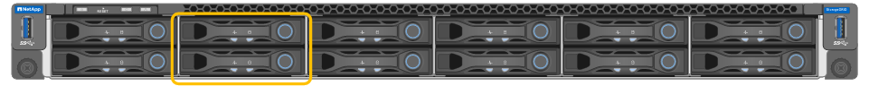
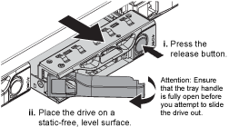

= Replace drive in SG6100-CN
:icons: font
:imagesdir: ../media/

[.lead]
The SG6160 appliance contains two SSD drives in the SG6100-CN controller which function as a read cache. If one of these drives fails, you must replace it as soon as possible to minimize the potential performance impact.

.Before you begin

* You have link:locating-sgf6112-in-data-center.html[physically located the appliance].
* You have verified which drive has failed by noting that its left LED is solid amber or using Grid Manager to link:verify-component-to-replace.html[view the alert caused by the failed drive].
* You have obtained the replacement drive.
* You have obtained proper ESD protection.

.Steps

. Verify that the drive's left fault LED is amber or use the drive slot ID from the alert to locate the drive.
+
The drives are in the following positions in the chassis (front of chassis with bezel removed shown).
+

. Wrap the strap end of the ESD wristband around your wrist, and secure the clip end to a metal ground to prevent static discharge.
. Unpack the replacement drive, and set it on a static-free, level surface near the appliance.
+
Save all packing materials.

. Press the release button on the failed drive.
+

+
The handle on the drive springs open partially, and the drive releases from the slot.

. Open the handle, slide the drive out, and place it on a static-free, level surface.
. Press the release button on the replacement drive before you insert it into the drive slot.
+
The latch springs open.
+
image::../media/h600s_driveinstall.gif[Drive Installation]

. Insert the replacement drive in the slot, and then close the drive handle.
+
CAUTION: Don't use excessive force while closing the handle.
+
When the drive is fully inserted, you hear a click.
+
When both SSD drives are functioning normally, the system will automatically restore read-cache functionality. You can https://review.docs.netapp.com/us-en/storagegrid-118_main/monitor/running-diagnostics.html[run diagnostics^] to monitor the read-cache hit rate. Since the cache was just rebuilt, the hit rate may be low initially, but should increase over time as the cache is repopulated by clients accessing object data.

include::../_include/fru-statement.adoc[]
